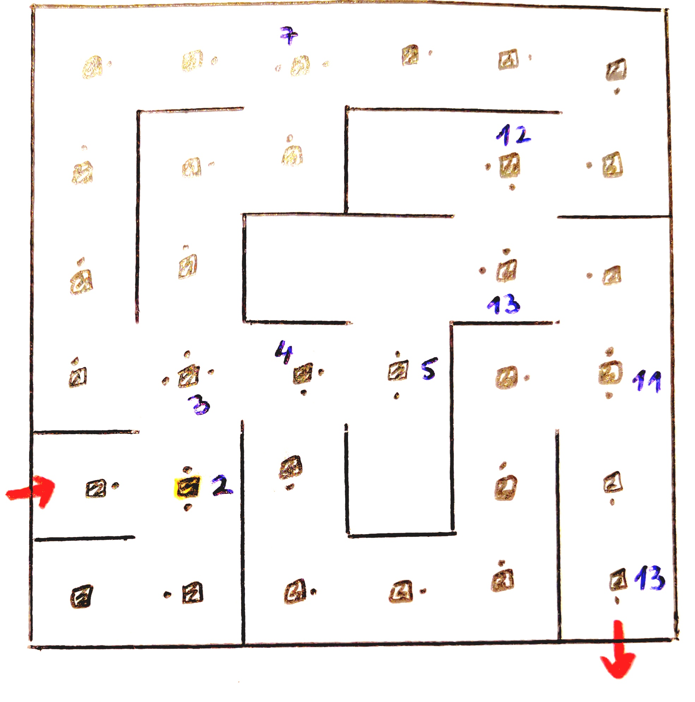
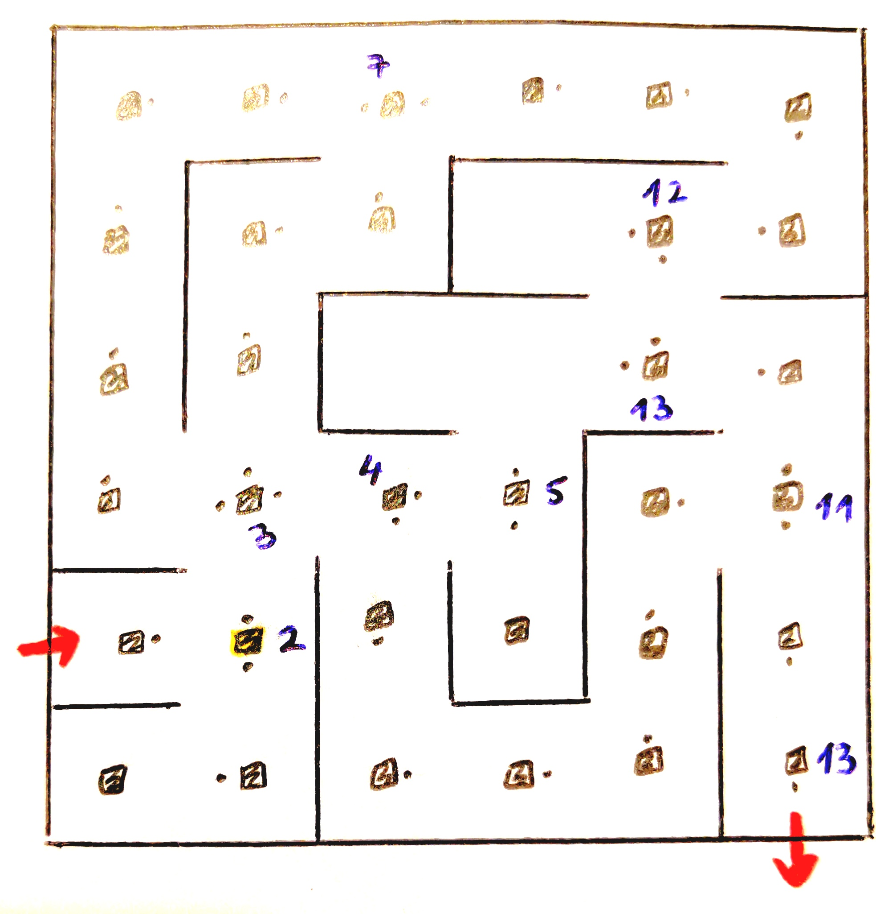
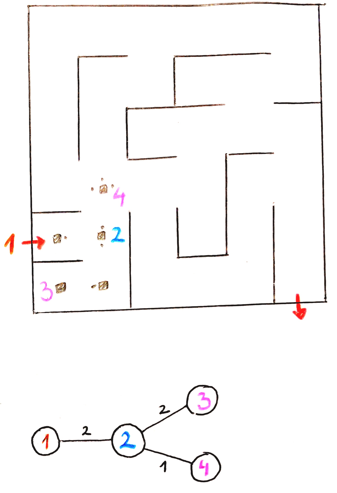

# **ALGORITMI V LABIRINTIH**

**Avtorja:** Tamara Pogačar, Matej Čušin

**Datum:** 3. 12. 2020

---

# Vrste labirintov

Obstaja več vrst labirintov. Kot otroci se srečamo predvsem z 2D labirinti na papirju, ki imajo en vhod in en izhod, potrebno pa je najti poljubno pot med njima. Med učenjem zgodovine naletimo na raznorazne "naravne" labirinte, ki so bodisi zidani, bodisi narejeni iz žive meje (npr. Knosos, razni grajski labirinti). Ko se lotevamo reševanja labirintov, nam ta delitev ni v veliko pomoč. Zato labirinte raje ločimo na:
- dvo-dimenzionalne in več-dimenzionalne;
- standardne (oz. idealne), ki so brez zank in zato ekvivalentni drevesom, in labirinte z zankami.

Pomembno je tudi, kakšen pogled imamo na labrint. Pristop k reševanju je običanjno odvisen od našega vedenja o labirintu - ali se nahajamo zunaj labirinta in imamo pogled na celoten labirint (ptičja perspektiva), ali pa smo postavljeni nekam znotraj labirinta ter do podatkov o labirinu dostopamo s preiskovanjem (sprehodom po labirintu in z beleženjem podatkov o njem).

Ne glede na tip labirinta ter naše začetno vedenje o njem lahko `labirint zapišemo v obliki grafa`. To je uporabno predvsem, ker z grafi znamo operirati, s "slikami" pa v splošnem ne. 


---

# Zapis labirinta v obliki grafa

###### Privzeto po: (Shortest path through a maze, 14. 11. 2020)


Ob pogledu na labirint je s prostim očesom običajno težko hitro najti pot med dvema točkama v njem. Ker vemo, da labirint sestoji iz hodnikov in križišč, si ga lahko predstavljamo kot neke vrste graf. V tem grafu bodo `vozlišča predstavljala hodnike`, `povezave pa križišča`, saj na vsakem križišču vemo, do katerih hodnikov lahko dostopamo.

Poraja se vprašanje, kako učinkovito pretvoriti labirint v graf. Če poznamo celoten labirint (pogled s ptičje perspektive), si lahko pomagamo s `številčenjem hodnikov`. Torej: začnemo številčiti v nekem oglišču labirinta in cel hodnik označimo z istim številom. Ko pridemo do križišča, vsakega od naslednjih hodnikov označimo z drugim številom. Pri številčenju v nekem križišču vedno uporabimo le števila, ki pred tem še niso bila uporabljena. Postopek nadaljujemo, dokler ne oštevilčimo celotnega labirinta.


S tem postopkom dobimo graf, ki nazorno predstavlja dan labrint. Da najdemo pot v labirintu, poiščemo ustrezno pot v grafu. Pri enostavnih labirintih je ta pot očitna in jo lahko hitro preberemo iz grafa, pri bolj zapletenih pa si je potrebno pomagati z ustreznimi algoritmi za reševanje labirintov (npr. za iskanje najkrajše oz. najdaljše poti, ugotavljanje obstoja poti med dvema točkama, iskanje vseh različnih poti ...).


S pomočjo zgornjega grafa lahko določimo eno od možnih poti od vhoda v labirint, predstavljenega z vozliščem `1`,  do izhoda, predstavljenega z vozliščem `11`. Rešitev `1 -> 3 -> 7 -> 11` je predstavljena na spodnji sliki.


Če ne poznamo celotnega labirinta (npr. igramo strelsko igro ter se nahajamo znotraj nekega večjega objekta z mnogo hodniki), lahko labirint spoznamo s pomočjo preiskovanja. Nekaj algoritmov za preiskovanje labirintov si bomo ogledali v nadaljevanju.

---

Zgoraj smo si ogledali preprost primer labirinta brez krožnih poti. Ker labirint ni imel krožnih poti, je bil pripadajoči graf brez ciklov (torej drevo). Za boljše razumevaje predstavitve labirinta z grafom si oglejmo še primer labirinta s krožnimi potmi.


## Labirint s krožnimi potmi

Dan je labirint:


Ponovimo že znani postopek številčenja hodnikov.


Ugotovimo, da je en hodnik lahko označen z več številkami. To se zgodi samo pri nekaterih hodnikih, ki so del krožnih poti labirinta, kar pa na samo predstavitev labirinta z grafom ne vpliva bistveno. Če bi želeli poiskti najdaljšo oz. najkrajšo pot v labirintu s pomočjo grafa, bi preprosto upoštevali dolžine "hodnikov". Opazimo, da skupna vsota dolžin "hodnikov" znotraj enega hodnika v labirintu še vedno ustreza dejanski dolžini tega hodnika. Na primer hodnik označen s `6` in `15` je dolg `5` enot, pri čemer opazimo, da je "hodnik" označen s `6` dolg `1` enoti, "hodnik" označen s `15` pa `4` enote. Torej je skupna vsota res enaka: `1 + 4 = 5`. Seveda se lahko deljenem številčenju hodnikov izognemo z uporabo drugačnega algoritma za številčenje, vendar ta razmislek prepustimo `bralcu za vajo`.

Dan labirint predstavimo z grafom:


Spomnimo se, da iščemo pot od vozlišča `1` do vozlišča `9`. Opazimo, da imamo več možnih poti. To se zgodi, ker je graf cikličen. Sedaj označimo eno izmed ustreznih poti.


Opazimo, da so nekatere izmed možnih poti:
* `1 -> 3 -> 4 -> 7 -> 9`
* `1 -> 3 -> 4 -> 8 -> 17 -> 12 -> 10 -> 7 -> 9`
* `1 -> 3 -> 4 -> 8 -> 17 -> 12 -> 10 -> 7 -> 4 -> 3 -> 5 -> 16 -> 13 -> 11 -> 10 -> 7 -> 9`
* `1 -> 3 -> 6 -> 15 -> 13 -> 16 -> 5 -> 3 -> 4 -> 8 -> 17 -> 12 -> 10 -> 7 -> 9`
* `1 -> 3 -> 6 -> 15 -> 13 -> 16 -> 5 -> 3 -> 6 -> 15 -> 13 -> 16 -> 5 -> 3 -> 4 -> 7 -> 9`

Spomnimo se, da v cikličnih grafih obstaja možnost, da se nekaj časa sprehajamo po nekem ciklu, kar v našem primeru labirinta (same pozitivne uteži) občutno podaljša pot med vhodom in izhodom.


Preden se lotimo preiskovalnih algoritmov, si poglejmo, kako lahko graf predstavimo.


---

# Zapis grafa

Obstaja kar nekaj vrst grafov (usmerjeni, neusmerjeni, oteženi ...). S katero vrsto grafa imamo opravka, je odvisno predvsem od tega, kaj želimo z njim narediti. Torej, če želimo poiskati najkrajšo oz. najdaljšo pot, bomo imeli opravka z `oteženimi grafi`. Pri tem bodo oteži na vozliščih predstavljale dolžine hodnikov v labirintu. Če imamo kakšen enosmeren prehod, bomo imeli opravka z `usmerjenimi grafi`, saj bomo le tako lahko nazorno predstavili omejitve gibanja. Pri tem je dobro vedeti, da nam usmerjene povezave v grafih dajo urejene pare vozlišč. Če želimo le preiskati celoten labirint, v katerem so vsi hodniki prehodni v obe smeri, lahko enostavno vzamemo neotežen neusmerjen graf.

Obstaja več metod zapisa grafa, od katerih sta najpogostejša zapisa z:
- `matriko sosednosti`;
- `tabelo sosednosti`.

Natančneje si bomo ogledali tabelo sosednosti.

## Tabela sosednosti

Tabela sosednosti je tabela tabel, kjer vsaka podtabela vsebuje vozlišče in njegove sosede. Na primer imamo vozlišče `A`, katerega sosedi so vozlišča `B`, `C` in `D`. To zapišemo `'A': ['B', 'C', 'D']`. Dve vozlišči sta sosednji, če je prvo povezano z drugim. Če je graf usmerjen in imamo nekje enosmerno povezavo, moramo paziti, kdo je sosed koga.

**Naredimo tabelo sosednosti za zgornji graf:**
```python
# tabela sosednosti
tab = {
    1: [2, 3],
    2: [1, 4, 5],
    3: [1, 6, 7],
    4: [2],
    5: [2],
    6: [3, 8, 9],
    7: [3, 10, 11],
    8: [6],
    9: [6],
    10: [7],
    11: [7]
    }
```

---

# Preiskovanje grafa


Ogledali si bomo dva algoritma za preiskovanje grafa - `pregled v globino` (eng. depth first search) in `pregled v širino` (eng. breadth first search).

Ker je naš prvotni namen preiskati celoten graf in na koncu izpisati `pot` pregledovanja, bomo v obeh primerih beležili pot iskanja v grafu. Poleg tega bomo beležili `obiskana` vozlišča. Tako bomo zagotovili, da bomo vsako vozlišče obiskali natanko enkrat. Pregled bomo začeli v vozlišču, imenovanem `koren`, ki ga algoritem skupaj s tabelo sosednosti `grafa`  dobi kot vhodni podatek.

Če korena ni v grafu ali pa sam koren ne obstaja (`koren == None`), algoritem sproži napako o neustreznem vnosu podatkov. V nasprotnem primeru ta koren dodamo v ustrezno podatkovno strukturo (označimo `PS`). Ta vsebuje vsa do sedaj še neopredeljena vozlišča - na njih smo pri preiskovanju že naleteli (so neposredni nasledniki že pregledanih vozlišč), a še nismo pregledali njihovih naslednikov. Poleg PS beležimo tudi `obiskana` vozlišča. To so vsa vozlišča, na katera smo naleteli med preiskovanjem.

Na vsakem koraku poberemo vozlišče iz PS (hkrati ga nujno tudi odstranimo).
1. Vozlišče dodamo na pot.
2. Če ima to vozlišče naslednike, jih dodamo v PS ter jih označimo za obiskane.
3. Sicer nadaljujemo preiskovanje, tj. poberemo naslednje vozlišče iz PS.
4. Ko je PS prazna, smo pregledali celoten graf. Tedaj vrnemo pot.

Oglejno si **psevdokodo**:
```python
def naš_algoritem(G, koren):  # G je tabela sosednosti za graf
    # preverimo, ali so vhodni podatki ustrezni
    if koren ni v grafu ali koren ne obstaja:
        return napaka
    # vemo, da so vhodni podatki ustrezni
    naj bo `PS` ustrezna podatkovna stuktura
    PS.vstavi(koren)  # pregled vedno pričnemo v korenu
    obiskan.dodaj(koren)
    ustvari pot
    while PS ni prazen:
        # odstrani vozlišče iz PS, da lahko obišče njegove naslednike
        trenutni = PS.poberi()
        # dodamo trenutnega na pot preiskovanja
        pot.dodaj(trenutni)
        # vse neobiskane naslednike od trenutnega vozlišča doda v PS
        for vsi nasledniki xyz od trenutni v grafu G:
            if xyz še ni obiskan:
                PS.vstavi(xvz)
                obiskan.dodaj(xyz)
    return pot
```
###### Privzeto po: (Depth First Search, 20. 11. 2020)

## Iskanje v globino

Kot že ime pove, ta algoritem deluje na principu pregledovanja v globino. Temelji na `vračanju po isti poti` - pregleda vsa vozlišča s premikanjem naprej v globino grafa, če je le to možno, sicer se vrača do prvega vozlišča, kjer se ponovno lahko premakne globje.

Za boljšo predstavo, si oglejmo ta algoritem na grafu za naš preprost labirint brez krožnih poti.

**Primer:** Iskanje v globino začne preiskovanje v poljubnem (izbranem) vozlišču. Pri preiskovanju celotnega grafa se drži pravil:
1. v vozlišču z več povezavami (kjer ima možnost izbire poti) se loti preiskovanja *najbolj desne* nepregledne veje (tj. najbolj levega sina);
   
   

2. ko pride v vozlišče z vsemi pregledanimi povezavami, se vrača nazaj po preiskani poti do prvega vozlišča z nepregledano povezavo;
   
   

3. ko pregleda celoten graf, se ustavi.

*Opomba:* Če želimo v grafu najti nek točno določen element, sledimo zgornjemu postopku, le da se algoritem ustavi, ko najde iskani element oziroma preišče celoten graf (če taga elementa ni v grafu).

Poglejmo si enega izmed možnih pregledov grafa z uporabo iskanja v globino (barvne številke):


### Katero podatkovno strukturo moramo uporabiti za iskanje v globino?

Na enostavnem primeru si oglejmo delovanje algoritma:

1. Dan imamo graf `G` in koren `1`:
   
   
2. Pregled začnemo v korenu. Torej `1` dodamo v `PS` in ga označimo kot obiskanega, zato ga dodamo v `obiskan`:
   
   
3. Vzamemo `1` iz `PS`, ga dodamo na `pot` in pogledamo njegove sosede. Soseda sta `2` in `32`. Ker še nista bila obiskana, torej nista v `obiskan`, ju dodamo v `obiskan` in v `PS`:
   
   
4. Vzamemo zadnje vozlišče iz `PS`, ga dodamo na `pot` in pogledamo njegove sosede. Torej sosedi od `2` so `1`, `4` in `61`. Ker je `1` že v `obiskan`, z njim ne naredimo ničesar. Torej samo vozlišči `4` in `61` dodamo v `obiskan` in v `PS`:
   
   
5. Ponovno vzamemo zadnje vozlišče iz `PS`, ga dodamo na `pot` in pogledamo njegovo sosede. Sesed od `4` je samo že obiskano vozlišče `2`, zato ne naredimo ničesar:
   
   
6. Vzamemo zadnjega iz `PS`, ga dodamo na `pot` in pogledamo njegove sosede. Edini neobiskani sosed vozlišča `61` je `14`, zato le tega dodamo v `obiskan` in v `PS`:
   
   
7. Ponovno vzamemo zadnje vozlišče iz `PS`, ga dodamo na `pot` in pogledamo njegove sosede. Opazimo, da trenutno vozlišče `14` nima neobiskanih sosedov, zato ne naredimo ničesar:
   
   
8.  Vzamemo zadnje vozlišče iz `PS`, ga dodamo na `pot` in pogledamo njegove sosede. Opazimo, da trenutno vozlišče `32` nima neobiskanih sosedov, zato ponovno ne naredimo ničesar:
   
    
9. Opazimo, da je `PS` prazna, kar pomeni da smo pregledali celoten graf. Torej vemo, da je v `pot` iskana pot preiskovanja.

Opazino, da mora podatkovna stuktura za algoritem iskanja v globino delovati na principu `zadnji noter, prvi ven`. Torej lahko uporabimo `sklad`.

### Časovna zahtevnost
Ker vemo, da bomo vsako vozlišče pregledali enkrat, prav tako tudi vsako povezavo, je pričakovana časovna zahtevnost iskanja v globino `O(V + P)`, pri čemer je `V = število vozlišč grafa` in `P = število povezav grafa`, če graf predstavimo s tabelo sosednosti.

*Iskanje v globino uporabimo predvsem pri iskanju najkrajše poti.*

## Iskanje v širino

Samo ime nam pove, da ta algoritem deluje na principu pregledovanja v širino. Torej `preiskuje po globinag` - ko pregleda vsa vozlišča na neki globini, nadaljuje s pregledovanjem vozlišč na naslednji globini.

Za boljšo predstavo si algoritem oglejmo na našem grafu za labirint.

**Primer:** Iskanje v globino začne preiskovanje v poljubnem (izbranem) vozlišču. Pri preiskovanju celotnega grafa se drži pravil:
1. najprej se premika horizontalno in pregleda vsa vozlišča na trenutni globini ter shrani njihove naslednike;
   
   

2. premakne se na naslednjo globino;
   
   
3. ko pregleda celoten graf, se ustavi.
   
   

*Opomba:* Če želimo v grafu najti nek točno določen element, sledimo zgornjemu postopku, le da se algoritem ustavi, ko najde iskani element oziroma preišče celoten graf (če taga elementa ni v grafu). Na ta način v danem grafu najdemo najkrajšo možno pot med korenom in iskanim vozliščem, dolžina pa predstavlja globino, na kateri se nahaja iskano vozlišče.

Poglejmo si enega izmed možnih pregledov grafa z uporabo iskanja v globino (barvne številke):


### Katero podatkovno strukturo moramo uporabiti za iskanje v širino?

Na enostavnem primeru si oglejmo delovanje algoritma:

1. Dan imamo graf `G` in koren `1`:
   
   
2. Pregled začnemo v korenu. Torej `1` dodamo v `PS` in ga označimo kot obiskanega, zato ga dodamo v `obiskan`:
   
   
3. Vzamemo `1` iz `PS`, ga dodamo na `pot` in pogledamo njegove sosede. Soseda sta `2` in `32`. Ker še nista bila obiskana, torej nista v `obiskan`, ju dodamo v `obiskan` in v `PS`:
   
   
4. Vzamemo prvo vozlišče iz `PS`, ga dodamo na `pot` in pogledamo njegove sosede. Torej soseda od `32` sta `1` in `14`. Ker je `1` že v `obiskan`, z njim ne naredimo nič. Torej samo vozlišče `14` dodamo v `obiskan` in v `PS`.
   
   
5. Vzamemo prvo vozlišče iz `PS`, ga dodamo na `pot` in ponovimo postopek iz `(2.)`. Torej sosedi od `2` so `1`, `4` in `61`. Ker je bilo vozlišče `1` že obiskani, z njim ne naredimo ničeran, torej dodamo v `obiskan` in v `PS` samo vozlišči `4` in `61`:
   
   
6. Ponovno vzamemo prvega iz `PS`, ga dodamo na `pot` in ponovimo postopek. Sodeda od `14` sta `61` in `32`, ker pa sta že oba v `obiskan`, ne naredimo ničesar:
   
   
7. Ponovno vzamemo prvega iz `PS`, ga dodamo na `pot` in pogledamo njegove sosede. Opazimo, da sta bila oba soseda od `61` že obiskana, zato ne naredimo ničesar:
   
   
8.  Vzamemo prvega iz `PS`, ga dodamo na `pot` in ugotovimo, da je bil njegov sosed (`2`) že obiskan, zato ne naredimo ničesar:
   
      
9.  Opazimo, da je `PS` prazna, torej vemo, da smo pregledali že celoten graf. Torej je v `pot` iskana pot preiskovanja.

Opazimo, da mora podatkovna stuktura za algoritem iskanja v širino delovati na principu `prvi noter, prvi ven`. Torej lahko uporabimo `vrsto`.

### Časovna zahtevnost
Ker vemo, da bomo vsako vozlišče pregledali enkrat, prav tako tudi vsako povezavo, je `pričakovana` časovna zahtevnost iskanja v globino `O(V + P)`, pri čemer je `V = število vozlišč grafa` in `P = število povezav grafa`, če graf predstavimo s tabelo sosednosti.
`

## Za kakšne grafe delujeta ta algoritma?

Kot je bilo razvidno iz zgornjih primerov, algoritma delujeta na `cikličnih` in `acikličnih` grafih. Po krajšem premisleku ugotovimo, da delujeta tudi na `usmerjenih` grafih. Opazimo pa, da zgoraj opisana implementacija ni ustrezna za pregledovanje `večdelnih` grafov, saj v takem primeru pregledamo le tisti del, v katerem se nahaja `koren`.

Če bi želeli pregledati celoten večdelni graf, bi morali vedeti, katera vozlišča tvorijo dani graf. Ko bi pri izvaljanju algoritma prišli do "konca", torej bi bila `PS` prazna, bi morali preveriti, ali je `množica obiskanih vozlišč enaka množici vseh vozlišč`. Če bi bili enaki, bi vedeli, da smo pregledali celoten graf, sicer pa bi vzeli neko še neobiskano vozlišče za novi `koren` in ponovili postopek. Tu bi se morali zavedati, da ob "koncu" preverimo, ali vsota na novo obiskanih vozlišč in tisti, obiskanih pred tem, ustrezata množici vseh vozlišč danega grafa.

---

# Aplikacija preiskovalnih algoritmov na konkretnem labirintu

Morda aplikacija obravnavanih algoritmov (predstavljenih na grafih) na labirinte ni povsem intuitivna. Zato si oglejmo nekaj primerov delovanja algoritmov na konkretnih labirintih.

---

## Iskanje v globino

### Labirint brez krožnih poti

1. Dan je labirint:
   
   

2. Začnemo pri vhodu v labirint. Na tem mestu s `kvadratkom` označimo potožaj v labirintu, s `pikami` ob stranicah kvadrata pa smeri, v katere lahko s trenutnega položaja potujemo. Pri tem označujemo le smeri različne od tiste, s katere smo prišli v trenutno točko:
  
   

3. Označimo celoten hodnik. Ko pridemo do križišča, označimo vse možne hodnike, v katere lahko nadaljujemo preiskovanje. Torej s pikami označimo vse potencialne poti preiskovanja:
  
   

4. Ker pregledujemo v globino, izberemo najbolj desno pot, torej v našem primeru nadaljujemo z gibanjem navzdol:
  
   

5. Ko pridemo do križišča, ponovimo postopek iz točke `(3.)` in nadaljujemo pot navzol:
  
   

6. Ponovno si izberemo najbolj desni hodnik in po njem nadaljujemo preiskovanje:
  
   

7. Ko pridemo do konca hodnika, ugotovimo, da smo prišli v `slep hodnik`. Torej se moramo vrniti nazaj po preiskovani poti vse do nekega križišča, ki nam ponovno omogoča izbiro poti gibanja. Pri vračanju si beležimo pot gibanja, saj bo le to indiciralo že preiskano pot (uporabimo `rdeče pike`):
  
   

8. Ko pridemo do ustreznega križišča, označimo, s katere smeri smo prišli vanj, saj bo le to indiciralo pregledanost hodnika. Ponovno izberemo najbolj desni hodnik in po njem nadaljujemo pot preiskovanja:
  
   

9. Ponovno prispemo v neko križišče, si označimo potencialne smeri gibanja in izberemo najbolj desni hodnik ter po njem nadaljujemo preiskovanje:
  
   

10. Ponovimo postopek iz točke `(9.)`:
  
    

11. Sedaj opazimo, da smo prispeli do iskanega `izhoda`. Na tem mestu lahko preiskovanje zaključimo, saj smo našli vsaj eno pot od `vhoda` do `izhoda`. Če želimo zapisati to pot, se vračamo po poti po kateri smo prispeli do izhoda. Pri tem na vsakem koraku izberemo smer, ki ni označena s piko. Če take poti ni, izberemo tisto, po kateri smo pri prvotnem preiskovanju prišli na trenutno mesto. Na primer v labirintu spodaj na sredini - vemo, da pot naravnost ne bo ustrezna, saj smo pri predhodnjem preiskovanju ugotovili, da gre za slep hodnik. Torej bomo izbrali smer, po kateri smo prišli v to križišče, torej bomo pot nadaljevali desno. Označimo dobljeno pot:

    

12. Če želimo preiskati celoten labirint, preskočimo točko `(11.)` in nadaljujemo s preiskovanjem. Torej se obnašamo tako, kot da bi prispeli v `slep hodnik`. Torej ponovimo postopek iz točke `(7.)`:
  
    

13. Prispeli smo v situacijo, podobno tisti iz točke `(8.)`, zato ponovimo že znan postopek:
  
    

14. Ponovno spoznamo, da se nahajamo v `slepem hodniku`, zato ponovimo postopek iz točke `(7.)`:
  
    

15. Prispeli smo v križišče, ki ima dva možna izhoda. Vemo, da smo enega izmed hodnikov že pregledali (tj. hodnik naravnost - označen z rdečo piko), torej je naša edina možnost potovanja po hidniku na desni:
  
    

16. Sprehodimo se po celotnem hodniku prispemo do križišča, iz katerega nadaljujemo potovanje po najbolj desnem še nepregledanem hodniku - torej pot nadaljujemo naravnost:
  
    

17. Ponovno ugotovimo, da smo preiskovali slep hodnik, zato ponovimo postopek iz točke `(7.)`:
  
    

18. Ko se vračamo po že preiskani poti, pridemo v križiče, za katerega vemo, da ima samo še en hodnik, po katerem laho nadaljujemo pot. To je edini hodnik, ki še ni označen z rdečo piko. Zato pot nadaljujemo po njem:
  
    

19. Ugotovimo, da smo se znašli v situaciji analogni tisti, iz točke `(18.)`. Torej ponovno pot nadaljujemo po edinem še ne preiskanem hodniku:
  
    

20. Prispeli smo do križiča, iz katerege pot nadaljujemo po najbolj desnem hodniku:
  
    

21. Ponovno smo prispeli v slep hodnih, zato se vrnemo nazaj do prvega križišča:
  
    

22. Znajdemo se v situaciji analogni tisti, iz točke `(18.)`:
  
    

23. Ponovimo postopek iz točke `(20.)`:
  
    

24. Ponovimo postopek iz točke `(21.)`:
  
    

25. Ponovimo postopek iz točke `(22.)`:
  
    

26. Ugotovimo, da smo se vrnili na začetek labirinta (tj. v točko, v kateri smo začeli preiskovanje) ter iz njega ne vodi noben nepregledan hodnik. Torej vemo, da smo preiskali celoten labirint.


**Ugotovimo:** Pri preiskovanju labirinta brez krožnih poti imamo več možnih situacij:

1. preiskujemo hodnik, dokler ne pridemo do nekega križišča:
   * pot nadaljujemo po najbolj desnem še nepregledanem hodniku (tj. hodnik, ki še ni označen z rdečo piko);
   * ugotovimo, da smo prišli na začetek preiskovanja (tj. vhod v labirint) ter smo že preiskali celoten labirint, zato zaključimo s preiskovanjem; 
2. preiskujemo slep hodnik. Ko pridemo do konca, se po njem vrnemo do prvega križišča, v katerem ozančimo, po katerem hodniko smo prišli vanj (tj. narišemo rdečo piko v smeri trenutnega hodnika), in ponovimo postopek iz točke `(1.)`.


### Labirint s krožnimi potmi

Postopek preiskovanja je analogen postopku za preiskovanje labirintov brez krožnih poti. Edina razlika se pojavi pri preiskuju krožne poti. Zato si oglejmo en primer preiskovanja v globinino na labirintu s krožnimi potmi, pri čemer nas ne bo zanimala pot do izhoda, temveč zgolj celoten pregled labirinta.

1. Dan je labirint:
   
    

2. Začnemo pri vhodu v labirint. Na tem mestu s `kvadratkom` označimo potožaj v labirintu, s `pikami` ob stranicah kvadrata pa smeri, v katere lahko s trenutnega položaja potujemo. Pri tem označujemo le smeri različne od tiste, s katere smo prišli v trenutno točko:
  
    

3. V križišču označimo vse možne poti preiskovanja. Preiskovanje nadaljujemo po najbolj desni poti:.
  
    

4. Sprehodimo se skozi celoten hodnik:
  
    

5. Iz slepega hodnika se vračamo nazaj do prvega križišča:
  
    

6. Pot nadaljujemo v skrajno desni še nepregledani hodnik:
  
    

7. Iz trenutnega križišča pot nadaljujemo v srajno desni nepregledani hodnik, torej se gibljemo naravnost:
  
    

8. Po slepem hodniku se vrnemo do prvega križišča:
  
    

9. Pot nadaljujemo po najbolj desnem še nepregledanem hodniku:
  
    

10. Iz križišča preiskovanje nadaljujemo po skrajno desnem hodniku: 
  
     

11. Pot nadaljujemo po desnem hodniku:
  
    

12. Našli smo izhod. Ker naš namen ni bil najti pot od vhoda do izhoda, temveč preiskati celoten labirint, se obnašamo, kot da smo naleteli na slep hodnik. Zato se vrnemo po hodniku vse do prvega križošča:
  
     

13. Pot nadaljujemo po skrajno desnem hodniku - gibljemo se naravnost:
  
    

14. Iz slepega hodnika se vrnemo do prvega križišča:
  
    

15. Pot nadaljujemo po edini možni poti in sicer desno:
  
    

16. Iz trenutnega križišča se gibljemo po skrajno desnem hodniku:
  
    

17. Prišli smo do točke, ki sicer še ni označena za pregledano (tj. nima rdeče pike, ki bi kazala v smer proti hodniku, v katerem se nahajamo), vendar ima `črno piko`, ki kaže v našo smer. To pomeni, da smo v labirintu našli krožno pot. Ker želimo pregledati preostanek labirinta, se odločimo, da `črno piko spremenimo v rdečo` ter se obnašamo enako, kot v slepem hodniku. Torej se vrnemo po trenutnem hodniku do prvega križišča:
  
    

18. Pot nadaljujemo po skrajno desnem hodniku:
  
    

19. Pot ponovno nadaljujemo po skrajno desnem hodniku:
  
    

20. Pot nadaljujemo po edinem še nepregledanem hodniku:
  
    

21. Ugotovimo, da smo se vrnili na začetek labirinta (tj. v točko, v kateri smo začeli preiskovanje) ter iz njega ne vodi noben nepregledan hodnik. Torej vemo, da smo preiskali celoten labirint.


**Ugotovimo:** Pri preiskovanju labirinta s krožnimi potmi imamo več možnih situacij:

1. preiskujemo hodnik, dokler ne pridemo do nekega križišča:
   * pot nadaljujemo po najbolj desnem še nepregledanem hodniku (tj. hodnik, ki še ni označen z rdečo piko);
   * ugotovimo, da smo prišli na začetek preiskovanja (tj. vhod v labirint) ter smo že preiskali celoten labirint, zato zaključimo s preiskovanjem; 
2. preiskujemo slep hodnik. Ko pridemo do konca, se po njem vrnemo do prvega križišča, v katerem ozančimo, po katerem hodniko smo prišli vanj (tj. narišemo rdečo piko v smeri trenutnega hodnika), in ponovimo postopek iz točke `(1.)`.
3. preiskujemo hodnik, dokler ne pridemo do točke, ki sicer še ni označena za pregledano (tj. nima rdeče pike, ki bi kazala v smer proti hodniku, v katerem se nahajamo), vendar ima `črno piko`, ki kaže v našo smer (tj. v labirintu smo našli krožno pot). Ker želimo pregledati preostanek labirinta, `črno piko spremenimo v rdečo` ter se obnašamo enako, kot v točki `(2.)`.

---

## Iskanje v širino

Oglejmo si aplikacijo algoritma za iskanje v širino na danih labirintih.

### Labirint brez krožnih poti

1. Dan je labirint:
   
     

2. Preiskovajne začnemo pri vhodu v labirint. Na tem mestu s `kvadratkom` označimo potožaj v labirintu, s `pikami` ob stranicah kvadrata pa smeri, v katere lahko s trenutnega položaja potujemo. Pri tem označujemo le smeri različne od tiste, s katere smo prišli v trenutno točko:
  
    

3. Ko pridemo do križišča, označimo vse možne poti iz njega in si jih zapomnimo, saj se bomo kmalu vrnili v to križišče in nadaljevali preiskovanje po preostalih poteh iz njega:
  
    

4. Torej na tem koraku nadaljujemo preiskovanje po skrajno desnem hodniku. Ko pridemo do križišča si zapomnimo vse poti, ki vodijo iz njega:
  
    

5. Vrnemo se do križišča iz točke `(3.)` in nadaljujemo preiskovanje v najbolj desni še nepregledani hodnik:
  
    

6. Ker smo po končanem postopku iz točke `(5.)` ugotovili, da je bil hodnik slep, v križišču iz točke `(3.)` pa ni bilo nobenega nepregledanega hodnika več, se premaknemo v križišče iz točke `(4.)` in v njem ponovimo postopek iz točke `(3.)`. Torej pot nadaljujemo v dnajbolj desni hodnik. Ko pridemo do križišča, si zapomnimo vse možne poti iz njega:
  
    

7. Vrnemo se nazaj v križišče iz točke `(4.)` in preiščemo preostali hodnik. Ugotovimo, da je hodnik slep:
  
    

8. Gremo v križišče iz točke `(6.)` in preiskujemo najbolj desni hodnik. Ugotovimo, da je slep:
  
    

9. Vrnemo se nazaj v križišče iz točke `(6.)` in preiskovanje nadaljujemo v najbolj desnem še neprehledanem hodniku. Ko pridemo do križišča, si zapomnimo, do katerih hodnikov lahko iz njega dostopamo:
  
    

10. Preiskovanje nadaljujemo v najbolj desni hodnik iz križišča iz točke `(9.)`. Ponovno si zapomnimo možne poti iz končnega križišča preiskovanega hodnika:
  
    

11. Vrnemo se nazaj v križišče iz točke `(9.)` in preiščemo preostali hodnik. Zanj ugotovimo, da je slep:
  
    

12. Vrnemo se v križišče iz točke `(10.)` in preiščemo najbolj desni hodnik. Ugotovimo, da nas ta hodnik pripelje do izhoda. Ker nas ne zanima pot od vhoda do izhoda, to dejstvo zanemarimo in se obnašamo, kot da smo naleteli na slep hodnik:
  
    

13. Vrnemo se v križišče iz točke `(10.)` in preiščemo še zadnji nepregledani hodnik. Ugotovimo, da je tudi ta slep:
  
    

14. Ker smo preiskali vse hodnike, ugotovimo, da smo preiskali celoten labirint.


**Ugotovimo:** Pri preiskovanju labirinta brez krožnih poti imamo več možnih situacij:

1. preiskujemo hodnik, dokler ne pridemo do nekega križišča:
   * zapomnimo si vse hodnike, do katerih lahko iz njega dostopamo (nevključno tistega, po katerem smo vanj prišli);
   * ugotovimo, da smo pregledali že vse hodnike, do katerih lahko dostopamo iz trenutnega križišča. Tedaj preiskovanje nadaljujemo iz naslednjega križišča, ki smo si ga predhodnje zapomnili; 
2. preiskujemo slep hodnik. Ko pridemo do konca, vemo, da smo zaključili preiskovanje po tej "veji". Preiskovanje nadaljujemo iz naslednega križišča, ki smo si ga predhodnje zapomnili.


### Labirint s krožnimi potmi

Postopek preiskovanja je analogen postopku za preiskovanje labirintov brez krožnih poti. Edina razlika se pojavi pri preiskuju krožne poti. Zato si oglejmo en primer preiskovanja v širino na labirintu s krožnimi potmi, pri čemer nas ne bo zanimala pot do izhoda, temveč zgolj celoten pregled labirinta.

1. Dan je labirint:
   
    

2. Začnemo pri vhodu v labirint. Na tem mestu s `kvadratkom` označimo potožaj v labirintu, s `pikami` ob stranicah kvadrata pa smeri, v katere lahko s trenutnega položaja potujemo. Pri tem označujemo le smeri različne od tiste, s katere smo prišli v trenutno točko:
   
    

3. Pregledamo najbolj desni hodnik in si zapomnimo možne poti iz končnega križišča preiskovanega hodnika:
   
    

4. Vrnemo se v križišče iz točke `(2.)` in ponovimo postopek iz točke `(3.)`:
   
    

5. Premaknemo se v križišče iz točke `(3.)` in pregledamo njegov najbolj desni hodnik. Ugotovimo, da je hodnik slep:
   
    

6. Vrnemo se v križišče iz točke `(3.)` in pregledamo najbolj desni še nepregledani hodnik ter si zapomnimo hodnike, do katerih lahko dostopamo iz končnega križišča:
   
    

7. Prestavimo se v križišče iz točke `(4.)` in pregledamo najbolj desni še nepregledani hodnik. Ker pregledujemo krožno pot, naletimo na mesto, ki je že bilo pregledano - črna pika kaže v smer hodnika, po katerem smo prišli do tega mesta. V tem primeru vemo, da je sedaj ta hodnik pregledan ter se obnašamo enako kot v primeru slepega hodnika:
   
    

8.  Vrnemo se v križišče iz točke `(4.)` in poreiskovanje nadaljujemo v zadnji še nepregledani hodnik. Ponovno si zapomnimo, do katerih hodnikov lahko dostopamo iz končnega križišča:
    
    

9. Prestavimo se v križišče iz točke `(6.)`. Preiščemo še zadnji nepregledani hodnik, za katerega ugotovimo, da je slep:
    
    

10. Prestavimo se v križišče iz točke `(8.)` in pregledamo njegov skrajno desni hodnik. Ugotovimo, da je slep:
    
    

11. Vrnemo se v križišče iz točke `(8.)` in pregledamo zadnji še nepregledani hodnik, ki vodi iz njega. Ugotovimo, da je tudi ta hodnik slep:
    
    

12. Opazimo, da smo pregledali vse hodnike, ki smo si jih tekom preiskovanja zapomnili. Torej vemo, da smo preiskali celoten labirint.

**Ugotovimo:** Pri preiskovanju labirinta s krožnimi potimi imamo več možnih situacij:

1. preiskujemo hodnik, dokler ne pridemo do nekega križišča:
   * zapomnimo si vse hodnike, do katerih lahko iz njega dostopamo (nevključno tistega, po katerem smo vanj prišli);
   * ugotovimo, da smo pregledali že vse hodnike, do katerih lahko dostopamo iz trenutnega križišča. Tedaj preiskovanje nadaljujemo iz naslednjega križišča, ki smo si ga predhodnje zapomnili; 
2. preiskujemo slep hodnik. Ko pridemo do konca, vemo, da smo zaključili preiskovanje po tej "veji". Preiskovanje nadaljujemo iz naslednega križišča, ki smo si ga predhodnje zapomnili;
3. tekom preiskovanja hodnika naletimo na že pregledano mesto - črna pika kaže v smer hodnika, po katerem smo prišli do tega mesta. Torej vemo, da je sedaj ta hodnik pregledan ter se obnašamo enako kot v točki `(2.)`.


---

# Iskanje najkrajše poti v grafu

Do sedaj smo si ogledali, kako naredimo pregled labirinta z uporabo iskanja v globino in širino. Pri tem je bil naš namen preiskovanja preiskati celoten labirint (in najti pot preiskovanja). Kaj pa, če bi želeli o labirintu izvedeti kaj drugega - na primer katera je najkrajša pot v njem? Najprej premislimo, katerega izmed algoritmov bomo izbrali. Pri preiskovanju v širino preiskujemo po globinah. Torej je intuitivno ta algoritem primernejši za iskanje najkrajše poti. Spomnimom se, kako pregledamo nek labirint v globino. Pri tem nas bo zanimala zgolj najkrajša pot. Pri pregledovanju si bomo križišča na enaki globini označili z isto barvo. Barvanje križišč na samo rešitev sicer ne vpliva, vendar pripomore k boljši preglednosti same rešitve.

1. Dan je labirint:
   
    

2. Pregledamo prvi hodnik:
   
    

3. Predgledano desni hodnik in ugotovino, da je slep:
   
    
4. Pregledamo levi hodnik in oznčimo končno križišče ter smeri, v katere lahko nadaljujemo preiskovanje:
   
    
5. Prestavimo se v križišče iz točke `(4.)` in pregledamo desni hodnik. Ponovno označimo končno križišče ter do katerih hodnikov lahko iz njega dostopamo:
   
   
6. Preiščemo naslednji najbolj desni nepregledani hodnik križišča iz točke `(4.)` ter ponovimo že znani postopek označevanja končnega križišča:
   
    
7. Predledamo še zadnji hodnik križišča it točke `(4.)` ter ugotovimo, da smo imeli krožno pot, torej se obnašamo tako, kot b+v primeru slepega hodnika:
   
    
8.  Preiskovanje nadaljujemo iz križišča iz točke `(5.)`. Ponovno označimo končno križišče in hodnike, do katerih imamo iz njega dostop:
   
    
9.  Preiščemo še zadnji nepregledani hotnik križišča iz ročke `(6.)` in po znanem postopku označimo končno križišče:
    
    
10. Prestavimo se v križišče iz točke `(6.)` in ugotovimo, da je samo še en hodnik nepregledan. Pregledamo ga po že znanem postopku:
    
    
11. Vrnemo se v križišče iz točke `(8.)` in preiščemo najbolj desni hodnik. Ugotovimo, da nas vodi do `izhoda`:
    
    
12. Prispeli smo do izhoda. Sedaj nas zanima, po kateri poti smo se morali sprehoditi, da smo prišli vanj. Torej se vračamo po preiskani poti. To naredimo tako, da na vsakem koraku pogledamo `kvadratek` in `pike` okoli njega. Ugotovimo, da je vsak `kvadratek` označen z vsaj eno piko, poleg tega pa ima vsaj eno stranico neoznačeno. Opazimo, da je vedno samo ena neoznačena stranica, ki nam označuje potencialno smer gibanja - tj. kvadratek sredi hodnika ima eno strenico označeno s piko in tri neoznačene. Od neoznačenih je zgolj ena taka, ki omogoča nadaljevanje gibanja v njeni smeri. Torej bomo vselej izbrali tisto smer gibanja, ki ni označena s piko. Podobna situacija je tudi v križiščih:
    
    
13. Označimo celotno pot `od izhoda do vhoda`:
    
    
14. Našli smo najkrajšo pot v labirintu:
    
    


## Smo res dobili najkrajšo pot med vhodom in izhodom?

Ne. Dobili smo najmanjše število hodnikov, skozi katere se moramo na tej poti (od vhoda do izhoda) sprehoditi. Seveda to ni nujno edina rešitev, a je zagotovo ustrezna. Lahko se zgodi, da je dobljena pot tudi najkrajša, vendar je to zgolj slučaj.

### Kaj je šlo narobe?

Ugotovimo, da bi bila ta rešitev ustrezna, če bi bili vsi hodniki enakih dolžin. Žal to v našem primeru ne drži. Zato si oglejmo, kako bi pri iskanju najkrajše poti upoštevali dolžine hodnikov.


1. Dan je labirint:
   
   
2. Označimo prvi hodnik in končnemu križišču dodelimo neko `število`. To število ustreza minimalni prepotovani dolžini do tega križišča. Torej predstavlja najmanjše število prehojenih enot do vključno trenutnega križišča:
    
   
3. Preiščemo desni hodnik in ugotovimo, da je slep. Vemo, da najkrajša pot ne bo vsebovala slepih hodnikov:
   
   
4. Preiščemo levi hodnik iz trenutnega križišča in končnemu križoišču dodelimo število, ki bo vsota števila predhodnjega križišča in dolžine trenutnega hodnika - `2 + 1 = 3`:

   
5. Peiščemo desni hodnik iz trenutnega križišča in mu dodelimo `pripradajočo oddajlenost od vhoda` - `3 + 1 = 4`
   
   
6. Peiščemo najbolj desni še nepreiskani hodnik iz trenutnega križišča in mu dodelimo `pripradajočo oddajlenost od vhoda` - `3 + 4 = 7`
   
   
7. Peiščemo najbolj desni še nepreiskani hodnik iz trenutnega križišča in ugotovimo, da nas pripelje do že preiskanjega križišča. Na tem mestu nas zanima, katera od preiskanih poti do trenutnega križišča je krajša - prejšnja (`7`) ali trenutna (`3 + 6 = 9`). Ugotovimo, da je bila prejšnja krajša, torej se obnašamo tako, kot v primeru slepega hodnika:
   
   
8. Preiskovanje nadaljujemo iz križišča iz točke `(6.)`. Preiščemo skrajno desni hodnik in končnemu križišču dodelimo število `4 + 7 = 11`:
   
   
9. Preiščemo najbolj desni še nepreiskani hodnik križišča iz točke `(6.)` ter končnemu križišču dodelimo število `4 + 1 = 5`:
    
     
10. Preiskovanje nadaljujemo iz križišča iz točke `(7.)`. Preiščemo najbolj desni še nepreiskani hodnik ter končnemu križišču dodelimo število `7 + 5 = 12`:
    
    
11. Preiskovanje nadaljujemo iz križišča iz točke `(8.)`. Preiščemo najbolj desni še nepreiskani hodnik ter ugotovimo, da nas pripelje do izhoda. Na tem mestu zadnji točki v hodniku dodelimo število, saj nas zanima, kolikšna bo najkrajša pot od vhoda do izhoda. Torej ji pripišemo število `11 + 2 = 13`:
    
    
12. Ker ne vemo, ali je bila to res najkrajša pot, nadaljujemo s preiskovanjem, dokler ne preiščemo celotnega labirinta. Torej nadaljujemo s preiskovanjem najbolj desnega še nepreiskanega hodnika križišča iz točke `(8.)`. Končnemu križišču pripišemo število `11 + 2 = 13`:
    
    
13. Preiskovanje nadaljujemo iz križišča iz točke `(9.)`. Preiščemo najbolj desni še nepreiskani hodnik ter ugotovimo, da je slep:
    
    
14. Preiščemo najbolj desni še nepreiskani hodnik križišča iz točke `(9.)` ter končnemu križišču dodelimo število `5 + 1 = 6`:
    
    
15. Preiskovanje nadaljujemo iz križišča iz točke `(10.)`. Preiščemo najbolj desni še nepreiskani hodnik ter ugotovimo, da nas pripelje do že preiskanjega križišča. Na tem mestu nas zanima, katera od preiskanih poti do trenutnega križišča je krajša - prejšnja (`13`) ali trenutna (`12 + 1 = 13`). Ugotovimo, da sta enaki, torej opazimo, da sta poti enakih dolžin. Ker za sam rezultat ni relevantno po kateri poti pripotujemo do trenutnga križišča, se odločimo, da se obnašano tako, kot v primeru slepega hodnika:
    
    
16. Preiščemo najbolj desni še nepreiskani hodnik križišča iz točke `(10.)` ter ugotovimo, da je hodnik slep:
    
    
17. Preiskovanje nadaljujemo iz križišča iz točke `(14.)`. Preiščemo najbolj desni še nepreiskani hodnik ter ugotovimo, da nas pripelje do že preiskanjega križišča. Na tem mestu nas zanima, katera od preiskanih poti do trenutnega križišča je krajša - prejšnja (`13`) ali trenutna (`6 + 1 = 7`). Ugotovimo, da je trenutna pot krajša. Torej popravimo število, ki pripada trenutnemu križišču. Novo število ternutnega križišča je torej `7`:
    
    
18. Ker vemo, da obstaja krajša pot do križišča iz točke `(17.)`, obstaja možnost, da obstaja krajša pot do križišča pred njim - tj. križišče, ki je bil po prejšnji preiskovalni poti predhodnik trenutnega. Zato nadaljujemo preiskovanje po poti, po kateri smo pred tem prišli do trenutnega križišča. Ugotovimo, da  predhodnjemu križišču (tj. križišču iz točke `(8.)`) pripada število `11`. Vemo pa, da bi mu po trenutni poti pripadalo število `7 + 2 = 9`. Ker opazimo, da je dolžina poti po trenutni poti preiskovanja krajša, križišču popravimo pripadan+joče število:
    
    
19. Ponovimo postopek iz točke `(18.)` in ugotovimo, da je tenutna pot do izhoda krajša od prejšnje, torej tudi pri izhodu popravimo število iz `13` na `9 + 2 = 11`:
    
    
20. Vrnemo se v križišče iz točke `(10.)` in preiščemo zadnji še nepreiskan hodnik. Ugotovimo, da je slep:
    
    
21. Ugotovimo, da smo preiskali celoten labirint. Po že znanem postopku se vrnemo po najkrajši poti do vhoda. Izbiro smeri potovanja iz posamezne točke za boljšo predstavi označimo z `rdečimo pikami`:
    
    
22. Dobili smo najkrajšo pot od vhoda do izhoda ter pripadajočo dolžino:
    
    


## Iskanje najkrajše poti v labirintu s pomočjo pripadajočega grafa

Ugotovimo, da bi bilo za iskanje najkrajše poti ustrezneje labirint predstaviti z oteženim grafom. Le tako bi bila rešitev očitnejša ter lažje predstavljiva.


### Zapis labirinta z grafom

Ker bomo imeli opravka z labirintom s križnimi obhodi, vemo, da bomo do vsaj enega križišča lahko dostopali po več kot eni poti. Zato bomo vsa križišča označevali z zaporednimi številkami (vemo, da sama oznaka križišča ne vpliva na sam rezultat). Povezave med njimi bodo predstavljale hodnike. Ker so hodniki različnih dolžin, bomo vsako povezavo otežili s številko, ki bo predstavljala število dolžinskih enot hotnika.

Oglejmo si, kako to storimo za zgornji primer.

1. Dan je labirint:
   
   
2. S številom `1` označimom `vhod`. To vozlišče tudi zapišemo:
   
   
3. Preiščemo hodnik ter končno križišče označimo z `2`. Zapišemo vozlišče `2` in povezavo med `1` in `2` otežimo z `2`, saj je dolžina hodnika, vključno s trenutnim križiščem enaka `2`:
   
   
4. Preiščemo desni hodnik iz vozlišča `2` in ugotovimo, da je slep. Končno točko križišča označimo s `3`, povezavo med vozliščema `2` in `3` pa otežimo z `2`:
   
   
5. Preiščemo levi hodnik iz vozlišča `2` in končno križišče označimo s `4`. Povezavo med vozliščema `2` in `4` otežimo z `1`:
   
   
6. Preiščemo desni hodnik iz vozlišča `4`in končno križišče označimo s `5`. Povezavo med vozliščema `4` in `5` otežimo z `1`:
   
   
7. Preiščemo najbolj desni nepregledani hodnik iz vozlišča `4`in končno križišče označimo s `6`. Povezavo med vozliščema `4` in `6` otežimo s `4`:
   
   
8. Preiščemo levi hodnik iz vozlišča `4`in opazimo, da je končno križišče že označeno s `6`. Torej do križišča `6` vodita vsaj dva hodnika. Torej v grafu želimo dodati povezavo do vozlišča `6`. Novo povezavo med vozliščema `4` in `6` otežimo s `6`:
   
    
9. Preiskovanje nadaljujemo iz križišča `5`. Preiščemo desni hodnik in končno križišče označimo s `7`, povezavo med njima pa otežimo s `7`:
    
     
10. Preiskovajne nadaljujemo v najbolj desnem nepregledanem hodniku iz križišča `5`. Končno križišče označimo z `8`, povezavo med vozliščema `5` in `8` pa otežimo z `1`:
    
    
11. Premaknemo se v križišče `6` in pregledamo edini še nepregledani hodnik. Končno križišče označimo z `9`, povezavo med `6` in `9` pa otežimo s `5`:
    
    
12. Preiskovanje nadaljujemo iz križišča `7`. Preiščemo njegov desni hodnik in ugotovimo, da nes pripelje do izhoda. `Izhod` označimo z vozliščem `10`, povezavo med `7` in `10` pa otežimo z `2`:
    
    
13. Preiščemo še levi hodnik iz križišča `7`. Končno križišče označimo z `11`, opvezavo med njima pa otežimo z `2`:
    
    
14. Preiskovanje nadaljujemo iz križišča `8`. Desni hodnik je slep, zato končno točko označimo z `12`, povezavo med `8` in `12` pa otežimo z `1`:
    
    
15. Levi hodnik iz križišča `8` vodi do novega križišča, ki ga označimo s `13`. Povezavo med križiščema v grafu otežimo z `1`:
    
    

16. Preiščemo še hodnike iz križišča `9`. Ugotovimo, da je desni hodnik slep. Označimo ga s `14`, povezavo pa otežimo z `1`. Opazimo, da preostali hodnik vodi do že pregledanega križišča. Torej v grafu zgolj dodamo povezavo med vozliščema `9` in `11` ter jo otežimo z `1`:
    
    

17. Pregledamo še hodnike iz vozlišča `13`. Ugotovimo, da nas desni pripelje do že pregledanega križišča. Torej samo dodamo povezavo med vozliščema `13` in `11` ter jo otežimo z `1`. Zadnji nepregledani hodnik iz križišča `13` je slep. Torej ga označimo s `15` ter povezavo otežimo z `1`:

    

18. Dobili smo otežen graf, ki predstavlja dani labirint.


### Iskanje najkrajše poti v grafu

Dobili smo ustezno predstavitev labirinta z grafom. Sedaj se lahko lotimo iskanja najkrajše poti v njem.

1. Dan je graf z oteženimi povezavami. Iščemo najkrajšo pot med vozliščema `1` in `10`:
   
   
2. Preblema se lotimo od zadaj. Vemo namreč, da moramo priti do vozlišča `10`. Da pridemo v željeno vozlišče, vemo, da bomo morali iti skozi njegovega predhodnika, torej skozi vozlišče `7`. Ker iščemo najkrajšo pot med dvema vozliščema, moramo od vozlišča `1` do vozlišča `7` priti po najkrajši možni poti. Najkrajšo možno pot do nekega vozlišča `x` označimo z `d(x)`. Torej bo najkrajša pot med vozliščema `1` in `10` enaka najkrajši poti od vozlišča `1` do `7`, keteri prištejemo utež povezave med vozliščema `7` in `10`. Torej mora veljati `d(10) = 2 + d(7)`:
   
   
3. Opazimo, da se je naš problem zmanjšal. Namesto, da iščemo `d(10)`, sedaj iščemo `d(7)`. Opazimo, da v vozlišče `7` vodita dve poti. Ena preko vozlišča `5`, druga preko vozlišča `11`. KEr nas zanima najkrajša mošžna pot, mora veljati `d(7) = min{7 + d(5), 2 + d(11)}`:
   
   
4. Torej nas sedaj zanimata vrednosti `d(5)` in `d(11)`. Torej za vsako od vozlišč `5` in `11` ponovimo že znani postopek. Ko prispemo do vozlišča `6` opazimo, da vanj vodita dve povezavi z različnima obtežitvama. Ker nas zanima najkrajša pot, bomo izbrali manjšo - `d(6) = d(4) + min{4, 6}`:
      
   
5. Nadaljujemo z določanjem `oddaljenosti oz začetnega vozlišča` vse dokler ne pridemo do njega. Tedaj se zavedamo, da je oddaljenost začetnega vozlišča od njega samega `ničelna`:
   
    

6.  Označimo še preostali del grafa:
    
    
7.  Sedaj pričnemo z računanje dejanskih oddaljenosti posameznih vozlišč. Ko pridemo v vozlišče `5` opazimo, da še ne moremo nadaljevati poti v vozlišče `7`, saj za določitev oddaljenosti vozlišča `7` potrebujemo tako `d(5)` kot tudi `d(11)`. Prav tako poramo za izračun oddaljenosti vozlišča `11` poznati tako `d(13)` kot tudi `d(9)`. Ugotovimo, da je `d(11)` najmanjša takrat, kadar v vozlišče `11` prispemo preko vozlišča `13`. To si na grafu tudi označimo:
    
    
8.  Ugotovili smo, da velja `d(10) = 11`. Torej sedaj vemo, da je najkrajša pot med vozliščema `1` in `10` dolga `11` enot:
    
    
9.  Zanima nas tudi katera pot je najkrajša. Torej označimo, po kateri poti smo se sprehodili od vozlišča `1` do vozlišča `10`:
    
    


Kot je bilo očitno, smo si pri iskanju najkrajše poti med dvema vozliščema v grafu pomagali z dimaničnim programiranjem. Opazimo, da je pričakovana časovna zahtevnost tega algoritma `O(V + P)`, kjer je `V` število vozlišč v grafu in `P` število povezav v njem.

---

# Iskanje najdaljše poti v grafu

Iskanje najdaljše poti je analogno iskanju najkrajše poti. Edina razlika je, da na vsakem koraku izberemo najdaljšo pot do nekega križišča namesto najkrajše (tj. vse `min()` nadomestimo z `max()`). Implementacijo prepustimo bralcu za vajo.


---

# Viri:
Depth First Search Algorithm In Python (Multiple Examples) (8. 11. 2020) Pridobljeno s: https://likegeeks.com/depth-first-search-in-python/#:~:text=%20Depth%20First%20Search%20algorithm%20in%20Python%20%28Multiple,to%20implement%20the%20DFS%20algorithm%20in...%20More%20

Shortest path through a maze (14. 11. 2020) Pridobljeno s: https://aakritty.wordpress.com/2014/03/02/shortest-path-through-a-maze/

Maze (10. 11. 2020) Prisobljeno s https://en.wikipedia.org/wiki/Maze

Search A Maze For Any Path - Depth First Search Fundamentals (Similar To "The Maze" on Leetcode) (7. 11. 2020) Pridobljeno s: https://youtu.be/W9F8fDQj7Ok

 Depth First Search (20. 11. 2020) Pridobljeno s: https://www.hackerearth.com/practice/algorithms/graphs/depth-first-search/tutorial/

 Breadth First Search (20. 11. 2020) Pridobljeno s: https://www.hackerearth.com/practice/algorithms/graphs/breadth-first-search/tutorial/

 Longest path in a directed Acyclic graph | Dynamic Programming (20. 11. 2020) Pridobljeno s: https://www.geeksforgeeks.org/longest-path-in-a-directed-acyclic-graph-dynamic-programming/

 Longest path in a Directed Acyclic graph | Dynamic Programming | GeeksforGeeks (20. 11. 2020) Pridobljeno s: https://youtu.be/YxF-x3imVFA