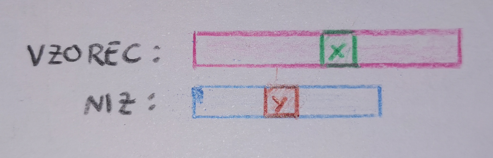

# **Dinamično programiranje | UJEMANJE NADOMESTNEGA VZORCA | Linearni čas in konstantni prostor**

**Ime:** Tamara Pogačar

**Datum:** 10. 12. 2020

---

# Kaj je nadomestni vzorec?

Običajni znaki:
- črke;

Dva nadomestna znaka:
- `?` nadomesti natanko en poljuben znak,
- `*` nadomesti poljuben niz - lahko tudi prazen.


---

# Problem:

Dana sta dva niza.
Prvi niz lahko vsebuje nadomestne znake.
Drugi niz vsebuje izključno običajne znake.
**Zanima nas, ali se dana niza ujemata.**


---

# Razlaga

1. `bla`:
   - `b?a`
   - `b*`
   - `b?`
2. `******`
3. `?????`


---

# Razlaga

| NADOMESTNI VZOREC      | NIZ           |  UJEMANJE   |
| :----  | :---  | :---: | 
| a*                     | amerika       | DA          |
| a*                     | maj           | NE          |
| a?cdef                 | abcdef        | DA          |
| a?cdef                 | acdef         | NE          |
| a?bc*                  | ažbc          | DA          |
| a?bc*                  | akbckobilica  | DA          | 
| a?bc*                  | abc           | NE          |

---

## Ugotovimo:
1. V nadomestnem vzorcu se lahko pojavi `?`.
   -  # `a?c` `abc`

2. V nadomestnem vzorcu se lahko pojavi `*`.
   -  # `a*c` `ac` 
   - # `a*c` `ahic`
  
  
---

# Kako se lotimo problema?

Postavimo se nekam na sredino danih nizov. 

Obravnavamo možnosti:
1. različna znaka;
2. enaka znaka;
3. `?`:
   1. konec niza;
   2. sicer;
4. `*`:
   1. ugotovimo ujemanje znakov;
   2. ignoriramo `*`;
5. konec enega od nizov.


---

# Algoritem:

```
Let T[i][j] is true if first i characters in given string matches the first j characters of pattern.   

 
DP Initialization: 

// both text and pattern are null
T[0][0] = true; 

// pattern is null
T[i][0] = false; 

// text is null
T[0][j] = T[0][j - 1] if pattern[j – 1] is '*'  
DP relation : 

// If current characters match, result is same as 
// result for lengths minus one. Characters match
// in two cases:
// a) If pattern character is '?' then it matches  
//    with any character of text. 
// b) If current characters in both match
if ( pattern[j – 1] == ‘?’) || 
     (pattern[j – 1] == text[i - 1])
    T[i][j] = T[i-1][j-1]   
 
// If we encounter ‘*’, two choices are possible-
// a) We ignore ‘*’ character and move to next 
//    character in the pattern, i.e., ‘*’ 
//    indicates an empty sequence.
// b) '*' character matches with ith character in
//     input 
else if (pattern[j – 1] == ‘*’)
    T[i][j] = T[i][j-1] || T[i-1][j]  

else // if (pattern[j – 1] != text[i - 1])
    T[i][j]  = false 
```
###### M. Lokar (osebna komunikacija, 27. 11. 2020)

---

# Primera reševanja

 1. Primerjamo **`p*o?`** in **`potop`**:
    - `x = p, y = p`
    - `x = *, y = o`
    - `x = *, y = t`
    - `x = *, y = o`
    - `x = o, y = o`
    - `x = ?, y = p`
1. Primerjamo **`*k?m*`** in **`krompir`**:
   - `x = *, y = k`
   - `x = k, y = k`
   - `x = ?, y = r`
   - `x = m, y = o`


---

# Časovna in prostorska zahtevnost

## Časovna zahtevnost

Najmanj: `O(1)`
Največ: `O(len(besedilo) + len(vzorec))`

## Prostorska zahtevnost

`O(1)`


---

# Viri:
Dynamic Programming | Wildcard Pattern Matching | Linear Time and Constant Space (1. 11. 2020) Pridobljeno s https://www.geeksforgeeks.org/dynamic-programming-wildcard-pattern-matching-linear-time-constant-space/

Coding Interview Question | Wildcard Matching | Dynamic Programming with Optimization (7. 11. 2020) Pridobljeno s https://youtu.be/7SHV_QfVROE