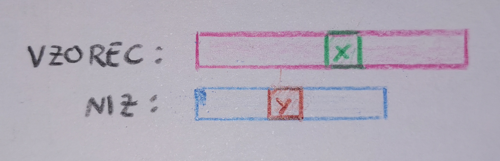
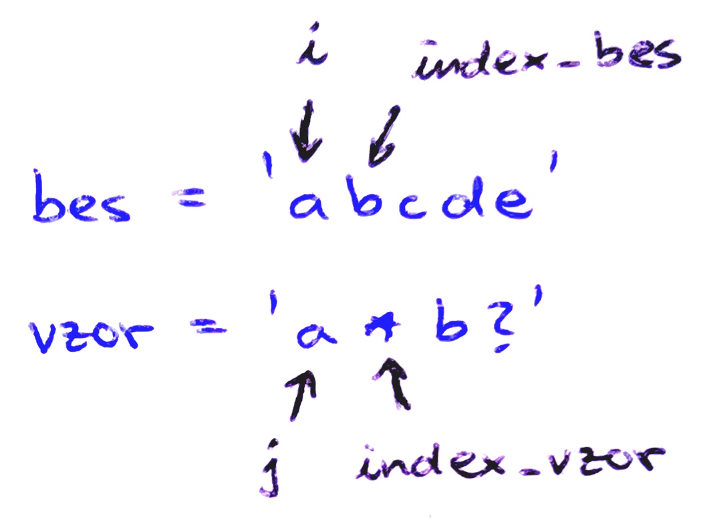

# **Ujemanje nadomestnega vzorca**

**Ime:** Tamara Pogačar

**Datum:** 10. 12. 2020

---

# Problem

Dana sta dva niza. Prvi niz lahko vsebuje posebne znake (niz imenujemo nadomestni vzorec), pri čemer lahko drugi niz vsebuje izključno običajne znake (na primer črke). Zanima nas, ali se dana niza ujemata.

Na primer niza `'abakus'` in `'a*'` se ujemata, med tem ko se `'nil'` in `'a*'` ne ujemata.

---

# Kaj je nadomestni vzorec?

Nadomestni vzorec je niz, v katerem lahko poleg običajnih znakov, kot so na primer črke, nastopata tudi dva posebna znaka, ki lahko nadomestita `nič ali več` znakov. Ta dva nadomestna znaka sta `'?'` in `'*'`:
- `'?'` nadomesti natanko en znak,
- `'*'` nadomesti poljuben niz - lahko tudi prazen.

---

# Razlaga

Tako vzorec `'b?a'` kot tudi `'b*'` se ujemata z nizom `'bla'`, med tem ko se vzorec `'b?'` z njim ne ujema. Opazimo tudi, da je več zaporednih `'*'` enakovrednih eni sami, `n` zaporednih `'?'` pa ustreza `n` poljubnim zaporednim običajnim znakom.

Za boljše razumevanje problema ter delovanja nadomestnih znakov si oglejmo še nekaj primerov.

| NADOMESTNI VZOREC      | NIZ               |  UJEMANJE   | KOMENTAR |
| :----                  | :---              | :---:       | :----- |
| `'a*'`                 | `'amerika'`       | DA          | Oba niza se začneta z `'a'`, za ujemanje preostalega niza pa poskrbi `'*'`. |
| `'a*'`                 | `'maj'`           | NE          | Niza se ne ujemata v prvem znaku: `'a' != 'm'`. |
| `'a?cdef'`             | `'abcdef'`        | DA          | Ker v nadomestnem vzorcu ne nastopa `'*'`, morata biti dolžini nizov enaki. Ugotovimo, da se niza ujemata, ter je `'?' == 'b'`. |
| `'a?cdef'`             | `'acdef'`         | NE          | Tretji znak v nizu bi moral biti `'c'`. Ker ni, ujemanje ni mogoče. |
| '`a?bc*'`              | `'ažbc'`          | DA          | Če postavimo `'?' = 'ž'` in `'*' = ''`. |
| `'a?bc*'`              | `'akbckobilica'`  | DA          | Opazimo, da velja `'?' == 'k'`, za ujemanjne nizov od četrtega znaka dalje pa poskrbi `'*'`. |
| `'a?bc*'`              | `'abc'`           | NE          | Nujno mora veljati `'?' == 'b'`, ko pa primerjamo tretja znaka, pa ugotovimo neujemanje: `'b' != 'c'`. |

### S pregledom različnih primerov lahko pridemo do naslednjih ugotovitev:

Ujemanje nizov bomo preverjali tako, da se bomo v obeh nizih premikali od leve proti desni in primerjali ustrezna znaka.

1. Če se v nadomestnem vzorcu pojavi `'?'`, vrednost tega `'?'` nastavimo na ustrezni znak iz niza. S tem se trenutna znaka v nadomestnem vzorcu in nizu ujemata, zato se premaknemo naprej in primerjamo naslednja znaka.
   - na primer, ko primerjamo `'a?c'` in `'abc'`:
     - ugotovimo ujemanje prvih dveh znakov: `'a' == 'a'`;
     - sprejmemo ujemanje drugih dveh znakov: `'?' == 'b'`;
     - ugotovimo ujemanje tretjih dveh znakov: `'c' == 'c'`;
     - ugotovimo ujemanje nizov.
2. Če se v nadomestnem vzorcu pojavi `'*'`, lahko `'*'` `primerjamo` s trenutnim znakom v nizu, ali pa `'*'` `ignoriramo`. Če se odločimo za ignoriranje zvezdice, se samo v vzorcu premaknemo en znak v desno. Če pa se odločimo za primerjanje znakov, sprejmemo njuno ujemanje in se samo v nizu prestavimo en znak naprej.
   - Na primer primerjamo `'a*c'` in `'ac'`:
     - ugotovimo ujemanje prvih dveh znakov: `'a' == 'a'`;
     - odločimo se, da `'*'` v nadomestnem vzorcu ignoriramo;
     - ugotovimo ujemanje zadnjih dveh znakov `'c' == 'c'`;
     - ugotovimo ujemanje nadomestnega vzorca z nizom.
   -  Primerjamo `'a*c'` in `'ahic'`:
      -  ugotovimo ujemanje prvih dveh znakov: `'a' == 'a'`;
      -  sprejmemo ujemanje `'*' == 'h'`;
      -  sprejmemo ujemanje `'*' == 'i'`;
      -  odločimo se, da `'*'` v nadomestnem vzorcu ignoriramo;
      -  ugotovimo ujemanje `'c' == 'c'`;
      -  ugotovimo ujemanje nadomestnega vzorca z nizom.
  
---

# Kako se lotimo problema?

Želimo ugotoviti enakost nizov, pri čemer moramo paziti na nadomestna znaka `'?'` in `'*'`. V splošnem se obnašamo tako, kot pri ugotavljanju enakosti običajnih nizov. To pomeni, da primerjamo niza od leve proti desni. Torej se bomo premikali od leve proti desni, tako po nizu, kot tudi po nadomestnem vzorcu.

Da bomo premislili, kakšen je splošen korak algoritma, se "postavimo" na sredino dogajanja. Predpostavimo, da smo do sedaj že dosegli ujemanje levih delov niza in vzorca. Pri tem predpostavimo, da sta oba leva dela "zaključena". Torej levi del vzorca ne zaključuje `'*'`. Sredinski znak v vzorcu označimo z x, v nizu pa y.



Sedaj obravnavamo možnosti:
1. znaka v vzorcu in nizu sta si različna, torej vemo, da se niza ne ujemata;
2. znaka v vzorcu in nizu sta enaka. Zato se tako v nizu, kot tudi v vzorcu, premaknemo za en znak v desno;
3. v vzorcu je `'?'`:
   1. v nizu smo že prišli do konca niza, torej vemo, da se niza ne ujemata;
   2. da zagotovimo ujemanje, moramo `'?'` nastaviti na `y`. Potem se tako v nizu, kot tudi v vzorcu, premaknemo za en znak v desno;
4. v vzorcu je `'*'`. Kaj naredimo v tem primeru, je odvisno od preostanka vzorca in niza (kako preverimo ujemanje preostanka nizov, je predstavljeno v razdelku `Kazalci`).
   1. če se preostanka nizov ujemata, `'*'` ignoriramo in se v vzorcu premaknemo en znak v desno;
   2. če se preostanka nizov ne ujemata, se v nizu premaknemo zn znak v desno;
5. en niz smo že pregledali, drugega pa ne. Torej se dana niza ne moreta ujemati.

---

# Primera reševanja

 Oglejmo si dva primera. Trenutno obravnavani znak v nadomestnem vzorcu označimo `x` v nizu pa z `y`.
 1. Primerjamo `'p*o?'` in `'potop'`:
    - `x = 'p', y = 'p'` torej imamo ujemanje znakov;
    - tako v nizu, kot tudi v nadomestnem vzorcu, se pomaknimo za en znak v desno;
    - `x = '*', y = 'o'`: ugotovimo ujemanje znakov;
    - v nizu se pomaknemo za en znak v desno;
    - `x = '*', y = 't'`: ugotovimo ujemanje znakov;
    - v nizu se pomaknemo za en znak v desno;
    - `x = '*', y = 'o'`: ignoriramo `'*'`;
    - v nadomestnem vzorcu se pomaknemo za en znak v desno;
    - `x = 'o', y = 'o'`: imamo ujemanje znakov;
    - tako v nizu kot tudi v nadomestnem vzorcu se pomaknemo za en znak v desno;
    - `x = '?', y = 'p'`: ugotovimo ujemanje znakov;
    - tako v nizu, kot tudi v nadomestnem vzorcu, se pomaknemo za en znak v desno;
    - ugotovimo, da smo tako v nizu kot tudi v nadomestnem vzorcu prišli do konca, torej vemo, da se niza ujemata.
2. Primerjamo `'*k?m*'` in `'krompir'`:
   - `x = '*', y = 'k'`: ugotovimo ujemanje znakov;
   - tako v nizu kot tudi v nadomestnem vzorcu se pomaknemo za en znak v desno;
   - `x = 'k', y = 'r'`: ugotovimo, da se znaka ne ujemata;
   - ker smo pred tem v vzorcu naleteli na `'*'`, se v vzorcu vrnemo do znaka za `'*'`, v nizu pa do `'k'` - za ujemanje nizov mora `'*'` predstavljati `'k'`, ali pa `'*'` predstavlja prazen niz. Odločimo se, da bomo najprej preverili ujemanje za primer praznega niza;
   - `x = '*', y = 'k'`: ugotovimo ujemanje znakov;
   - v nadomestnem vzorcu se pomaknemo za en znak v desno;
   - `x = 'k', y = 'k'`: ugotovimo ujemanje znakov;
   - tako v nizu kot tudi v nadomestnem vzorcu se pomaknemo za en znak v desno;
   - `x = '?', y = 'r'`: ugotovimo ujemanje znakov;
   - tako v nizu kot tudi v nadomestnem vzorcu se pomaknemo za en znak v desno;
   - `x = 'm', y = 'o'`: ugotovimo, da se znaka ne ujemata;
   - ker smo pred tem v vzorcu naleteli na `'*'`, se v vzorcu vrnemo do znaka za `'*'`, v nizu pa do znaka za `'k'` - za ujemanje nizov mora `'*'` predstavljati `'k'`, ali pa `'*'` predstavlja prazen niz. Preverili smo že primer praznega niza, zato zdaj preverimo, za primer nepraznega;
   - `x = 'k', y = 'r'`: ugotovimo, da se znaka ne ujemata;
   - ker smo pred tem v vzorcu naleteli na `'*'`, se v vzorcu vrnemo do znaka za `'*'`, v nizu pa do drugega znaka za `'k'` - `'*'` mora predstavljati `'kr'`;
   - `x = 'k', y = 'o'`: ugotovimo, da se znaka ne ujemata;
   - ker smo pred tem v vzorcu naleteli na `'*'`, se v vzorcu vrnemo do znaka za `'*'`, v nizu pa do tretjega znaka za `'k'` - `'*'` mora predstavljati `'kro'`;
   - `x = 'k', y = 'm'`: ugotovimo, da se znaka ne ujemata;
   - ker smo pred tem v vzorcu naleteli na `'*'`, se v vzorcu vrnemo do znaka za `'*'`, v nizu pa do četrtega znaka za `'k'` - `'*'` mora predstavljati `'krom'`;
   - `x = 'k', y = 'p'`: ugotovimo, da se znaka ne ujemata;
   - ker smo pred tem v vzorcu naleteli na `'*'`, se v vzorcu vrnemo do znaka za `'*'`, v nizu pa do petega znaka za `'k'` - `'*'` mora predstavljati `'kromp'`;
   - `x = 'k', y = 'i'`: ugotovimo, da se znaka ne ujemata;
   - ker smo pred tem v vzorcu naleteli na `'*'`, se v vzorcu vrnemo do znaka za `'*'`, v nizu pa do šestega znaka za `'k'` - `'*'` mora predstavljati `'krompi'`;
   - `x = 'k', y = 'r'`: ugotovimo, da se znaka ne ujemata;
   - ugoutovimo, da se niza ne moreta ujemati.

V zgornjih primerih opazimo, da bi si želeli vedeti, kdaj `'*'` ignoriramo in kdaj ne. Opazimo, da si želimo označiti mesti trenutnih primerjanih znakov nizov, poleg njih pa še mesta, do katerih bi se ob neusrezni odločitvi ignoriranja `'*'` morali vrniti. Očitno bomo za beleženje teh mest potrebovali štiri kazalce.

---

## Kazalci

Najprej si oglejmo idejo algoritma, predstavljeno s kazalci.

---

## Psevdokoda

**Osnovni primer:**

Če je dolžina vzorca enaka nič, je odgovor `True` natanko tedaj, ko je ničelna tudi dolžina niza, s katerim primerjamo vzorec.

Označimo:
- `bes` = niz
- `vzor` = nadomestni vzorec

**Inicializacija algoritma:**

1. Naj `i` kaže na trenutni znak v nizu.
   
   Naj `j` kaže na trenutni znak v vzorcu.
   
   Naj `index_bes` kaže na znak v nizu, kjer naletimo na `'*'` v vzorcu.
   
   Naj `index_vzor` kaže na položaj `'*'` v vzorcu.

   

2. Če kadarkoli opazimo, da je `bes[i] == vzor[j]`, povečamo `i` in `j` za `1`, saj nam v tem primeru ni potrebno opraviti nobene operacije (tj. znaka se že ujemata).
3. Če velja `vzor[j] == '?'`, je to podobno primeru `(2.)`, saj ima `'?'` lastnost ujemanja s poljubnim enojnim znakom.
4. Če velja `vzor[j] == '*'`, nastavimo vrednosti `index_bes` in `index_vzor`, saj ima `'*'` lastnost ujemanja s poljubnim zaporedjem (vključno praznim). Povečali bomo vrednost `j`, da primerjamo naslednji znak v vzorcu s trenutnim znakom v nizu. Zanima nas torej ujemanje preostalega dela vzorca (od `'*'` desno) s preostalim delom niza (od vključno trenutnega (označenega z `i`) dalje).
5. Sedaj, če je `bes[i] == vzor[j]` ter smo predhodnje naleteli na `'*'`, to pomeni, da je `'*'` vsebovalo prazno zaporednje. Sicer, če je `bes[i] != vzor[j]`, mora `'*'` predstavljati trenutni znak v nizu. Sedaj povečamo `i`, saj je bil trenutni odgovorjen. Vendar znak predstavljen z `j` še vedno potrebuje odgovor, zato nastavimo `j = index_vzor + 1` in `i = index_bes + 1` (saj `'*'` lahko vključuje tudi druge znake), `index_bes += 1` (saj se trenutni znak v nizu ujema).
6. Če je `bes[i] != vzor[j]`, prav tako pa nismo naleteli na `'*'`, pomeni, da se vzorec ne more ujemati z nizom (algoritem vrne `False`).
7. Preverimo, ali je `j` prišel do končne vrednosti, nato vrnemo končni odgovor (`True` ali `False`).

###### Dynamic Programming | Wildcard Pattern Matching | Linear Time and Constant Space (13. 10. 2020)


---

## Demonstracija algoritma na enostavnem primeru:

Želimo primerjati niza `bes = 'abcde'` in `vzor = 'a*d?'`. Niza bomo pregledovali od leve proti desni. Ker nadomestni vzorec lahko vsebuje `'*'`, za katero vemo, da lahko predstavlja poljubno dolg niz, bomo potrebovali dva različna kazalca. En kazalec (`i`) bo kazal, kateri znak v nizu trenutno pregledujemo, drug kazalec (`j`) pa bo kazal na trenutni znak v nadomestnem vzorcu.

1. Imamo:
   ```
    bes = 'abcde'
    vzor = 'a*d?'
    i = 0
    j = 0

    bes[i] = 'a'
    vzor[j] = 'a'
   ```
   Torej primerjamo `'a' == 'a'`, kar je očitno enako. Sedaj se premaknemo za en znak v desno, tj. `i` in `j` povečamo za `1`.

2. Sedaj imamo:
   ```
    bes = 'abcde'
    vzor = 'a*d?'
    i = 1
    j = 1

    bes[i] == 'b'
    vzor[j] == '*'
   ```
   Ker smo v nadomestnem vzorcu naleteli na `'*'`, imamo dve možmosti:
   1. `'*'` *predstavlja prazen niz*: v tem primeru bi preprosto ignorirali `'*'` (`j` bi povečali za `1`, `i` bi ostal nespremenjen) ter bi nadaljevali s primerjanjem;
   2. `'*'` *predstavlja neprazen niz*: ugotoviti bi morali, koliko znakov iz `bes` predstavlja `'*'`.

    Opazimo, da bi si želeli zabeležiti položaj, na katerem se pojavi `'*'` v nadomestni vzorcu - tj. tako položaj v vzorcu kot tudi v nizu. Zato uvedemo dva nova indeksa: `index_bes` in `index_vzor`. Kot že imeni povesta, bo `index_bes` beležil položaj v nizu, ki ustreza položaju pojavitve `'*'` v vzorcu, `index_vzor` pa bo hranil podatek o položaju `'*'` v vzorcu.

    Torej imamo:
    ```
    index_bes = i = 1
    index_vzor = j = 1
    ```
    Ker vemo, da `'*'` lahko predstavlja prazen niz, `j` in `index_vzor` povečamo za `1`. Zanima nas ujemanje preostanka nadomestnega vzorca (brez `'*'`) s še ne pregledanim delom niza. Torej:
    ```
    j = 2
    index_vzor = 2
    ```
3. Sedaj želimo ugotoviti ujemanje preostalega dela nadomestnega vzorca z nizom. Če bi `j` že kazal izven vzorca (tj. pregledali bi že vse znake v vzorcu - `'*'` bi bil zadni znak v nadomestnem vzorcu), bi algoritem vrnil `True`, saj če se niza do `'*'` ujemata, `'*'` na koncu poskrbi, da se ujemata tudi ostanka nizov.
     
    Ker v tem primeru `'*'` ne kaže na konec, primerjamo `bes[i] == vzor[j]`. Imamo torej:
     ```
    bes = 'abcde'
    vzor = 'a*d?'
    i = 1
    index_bes = 1
    j = 2
    index_vzor = 2

    bes[i] = 'b'
    vzor[j] = 'd'
     ```
    Torej imamo primerjavo `'b' == 'd'`, kar očitno ni enako. Ker še vedno pregledujemo `'*'`, to še ne pomeni, da se niz in nadomestni vzorec ne ujemata. To pomeni le, da mora `'*'` vsebovati trenutni znak v nizu, zato povečamo `index_bes` za `1`. Zavedamo se, da lahko `'*'` vsebuje še kakšen znak. Zato želimo primerjati naslednji znak v nizu in trenutnim v nadomestni vzorcu. Torej povečamo `i` za `1`.

4. Imamo:
   ```
    bes = 'abcde'
    vzor = 'a*d?'
    i = 2
    index_bes = 2
    j = 2
    index_vzor = 2

    bes[i] = 'c'
    vzor[j] = 'd'
   ```
   Torej primerjamo `'c' == 'd'`, kar očitno ni enako, zato ponovimo postopek iz prejšne točke (`i += 1, index_bes += 1`).

5. Imamo:
    ```
    bes = 'abcde'
    vzor = 'a*d?'
    i = 3
    index_bes = 3
    j = 2
    index_vzor = 2

    bes[i] = 'd'
    vzor[j] = 'd'
   ```
    Torej primerjamo `'d' == 'd'`, kar je očitno enako. Zato ugotovimo enakost zankov.
    
    A to še ne pomeni, da lahko pozabimo na `'*'`. Morda se naslednja znaka ne bosta ujemala in se bomo morali v nadomestnem vzorcu vrniti vse do `'*'` (nastaviti `j = index_vzor`, `i = index_bes + 1`) in ponoviti postopek za preostanek niza.
      
   - Če bi imeli `bes = 'ababca'` in `vzor = 'a*a'`, ki sta očitno enaka, bi morali vse do konca pregledovanja upoštevati, da smo v vzorcu naleteli na `'*'`, sicer bi prišli do napačne ugotovitve, saj se na mestu `i = 2` se pojavi `'a'`.
    
    Torej kazalca `index_bes` in `index_vzor` ohranimo, dokler ne naletimo na novo `'*'`. Da nadaljujemo s pregledovanjem, povečamo kazalca `i` in `j`.

6.  Imamo:
    ```
    bes = 'abcde'
    vzor = 'a*d?'
    i = 4
    index_bes = 3
    j = 3
    index_vzor = 2

    bes[i] = 'e'
    vzor[j] = '?'
    ```
    Torej primerjamo `'e' == '?'`, kar je očitno enako, saj `'?'` lahko predstavlja poljuben znak (tj. neprazen niz dolžine 1). Sedaj povečamo kazalca `i` in `j`.

7.  Imamo:
    ```
    bes = 'abcde'
    vzor = 'a*d?'
    i = 5
    index_bes = 3
    j = 4
    index_vzor = 2
    ```
    Opazimo, da smo prišli do konca obeh nizov (saj tako `i` kot tudi `j` kažeta izven pripadajočih nizov), zato vemo, da velja `bes == vzor`. Če bi v enem od nizov (niz ali nadomestni vzorec) prišli do konca, pri drugem pa ne, bi se niza ujemala le, če bi bil niz že pregledano, v nadomestni vzorcu pa bi bili nepregledani znaki izključno `'*'`. V ostalih primerih ujemanje ni mogoče.


Sedaj vemo, kako delujejo indeksi na enostavnem primeru. Za boljše razumevanje si oglejmo še en primer, ki na prvi pogled deluje kompleksnejši.

---

## Demonstracija algoritma na kompleksnejšem primeru:

Želimo primerjati niza `bes = 'alibrbb'` in `vzor = 'a*?b'`. Postopek reševanja bo analogen zgornjemu.

1. Imamo:
   ```
    bes = 'alibrbb'
    vzor = 'a*?b'
    i = 0
    j = 0

    bes[i] = 'a'
    vzor[j] = 'a'
   ```
   Torej primerjamo `'a' == 'a'`, kar je očitno enako, zato vemo, da se do tukaj niz in nadomestni vzorec ujemata. Sedaj se premaknemo za en znak v desno, tj. `i` in `j` povečamo za `1`.

2. Imamo:
   ```
    bes = 'alibrbb'
    vzor = 'a*?b'
    i = 1
    j = 1

    bes[i] = 'l'
    vzor[j] = '*'
   ```
   Ker smo v nadomestnem vzorcu naleteli na `'*'`, imamo ponovno dve možmosti (tj. `'*'` predstavlja prazen ali neprazen niz). Zato si zabeležimo položaj, na katerem se pojavi `'*'` v nadomestni vzorcu - tj. tako položaj v vzorcu kot tudi v nizu. Zato uvedemo dva nova indeksa: `index_bes` in `index_vzor`.

    Torej imamo:
    ```
    index_bes = i = 1
    index_vzor = j = 1
    ```
    Ker vemo, da `'*'` lahko predstavlja prazen niz, `j` in `index_vzor` povečamo za `1`. Zanima nas torej ujemanje preostanka nadomestnega vzorca (brez `'*'`) s še ne pregledanim delom niza. Torej:
    ```
    j = 2
    index_vzor = 2
    ```

3. Imamo:
   ```
    bes = 'alibrbb'
    vzor = 'a*?b'
    i = 1
    index_bes = 1
    j = 2
    idex_vzor = 2

    bes[i] = 'l'
    vzor[j] = '?'
   ```
   Torej primerjamo `'l' == '?'`, kar je očitno enako, saj `'?'` lahko predstavlja poljuben znak. Sedaj povečamo kazalca `i` in `j`. Kazalca `index_bes` in `index_vzor` ohranimo, saj ju bomo v nadaljevanju mogoče ponovno potrebovali.

4. Imamo:
   ```
    bes = 'alibrbb'
    vzor = 'a*?b'
    i = 2
    index_bes = 1
    j = 3
    idex_vzor = 2

    bes[i] = 'i'
    vzor[j] = 'b'
   ```
   Primerjamo `'i' == 'b'`, kar očitno ni enako. Ker vemo, da smo pred tem naleteli na `'*'`, še vedno ostaja upanje, da se dana niza ujemata. Sedaj se spomnimo na `index_bes` ter `index_vzor`. Vemo, da mora zvezdica vsebovati znak, na katerega kaže `index_bes`, zato ga povečamo za `1`. V `bes` se želimo vrniti vse do `index_bes + 1`, v ``vzor`` pa do `inex_vzor`. Zato nastavimo:
   ```
   index_bes += 1
   i = index_bes
   j = index_vzor
   ```

5. Imamo:
   ```
    bes = 'alibrbb'
    vzor = 'a*?b'
    i = 2
    index_bes = 2
    j = 2
    idex_vzor = 2

    bes[i] = 'i'
    vzor[j] = '?'
   ```
   Ker vemo, da velja ujemanje `'i' == '?'`, se v `bes` in `vzor` premaknemo naprej.

6. Imamo:
   ```
    bes = 'alibrbb'
    vzor = 'a*?b'
    i = 3
    index_bes = 2
    j = 3
    idex_vzor = 2

    bes[i] = 'b'
    vzor[j] = 'b'
   ```
   Primerjamo `'b' == 'b'` in ugotovimo ujemanje. Zato se v `bes` in `vzor` premaknemo mesto v desno.

7. Imamo:
   ```
    bes = 'alibrbb'
    vzor = 'a*?b'
    i = 4
    index_bes = 2
    j = 4
    idex_vzor = 2
   ```
   Ugotovimo, da smo v `vzor` prišli do konca, v `bes` pa ne, torej nimamo ujemanja znakov. Sedaj ponovimo postopek iz točke `(4.)`.

8. Imamo:
   ```
    bes = 'alibrbb'
    vzor = 'a*?b'
    i = 3
    index_bes = 3
    j = 2
    idex_vzor = 2

    bes[i] = 'b'
    vzor[j] = '?'
   ```
   Primerjamo `'b' == '?'` in ugotovimo ujemanje, zato se v `bes` in `vzor` premaknemo eno mesto v desno.

9. Imamo:
   ```
    bes = 'alibrbb'
    vzor = 'a*?b'
    i = 4
    index_bes = 3
    j = 3
    idex_vzor = 2

    bes[i] = 'r'
    vzor[j] = 'b'
   ```
   Primerjamo `'r' == 'b'` in ugotovimo, da se znaka ne ujemata. Zato ponovimo postopek iz točke `(4.)`.


10. Imamo:
      ```
      bes = 'alibrbb'
      vzor = 'a*?b'
      i = 4
      index_bes = 4
      j = 2
      idex_vzor = 2

      bes[i] = 'r'
      vzor[j] = '?'
      ```
      Opazimo, da velja ujemanje `'r' == '?'`, zato se v danih nizih premaknemo mesto v desno.

11. Imamo:
      ```
      bes = 'alibrbb'
      vzor = 'a*?b'
      i = 5
      index_bes = 4
      j = 3
      idex_vzor = 2

      bes[i] = 'b'
      vzor[j] = 'b'
      ```
      Ugotovimo ujemanje `'b' == 'b'`, zato se v obeh nizih premaknemo en znak v desno.

12. Imamo:
      ```
      bes = 'alibrbb'
      vzor = 'a*?b'
      i = 6
      index_bes = 4
      j = 3
      idex_vzor = 2
      ```
      Opazimo, da smo v `vzor` prišli do konca niza, a v `bes` še nismo. Zato se ponovimo postopek iz točke `(4.)`.

13. Imamo:
      ```
      bes = 'alibrbb'
      vzor = 'a*?b'
      i = 5
      index_bes = 5
      j = 2
      idex_vzor = 2

      bes[i] = 'b'
      vzor[j] = '?'
      ```
      Ugotovimo ujemanje `'b' == '?'` in se v obeh nizih premaknemo naprej.

14. Imamo:
      ```
      bes = 'alibrbb'
      vzor = 'a*?b'
      i = 6
      index_bes = 5
      j = 3
      idex_vzor = 2

      bes[i] = 'b'
      vzor[j] = 'b'
      ```
      Vidimo, da se trenutna znaka ujemata, zato se v obeh nizih premaknemo en znak v desno.

15. Imamo:
      ```
      bes = 'alibrbb'
      vzor = 'a*?b'
      i = 7
      index_bes = 5
      j = 4
      idex_vzor = 2
      ```
      Opazimo, da smo v obeh nizih prišli do konca, torej se dana niza ujemata.

---

# Algoritem

Oglejmo si, kako ta algoritem izgleda v luči dinamičnega programiranja. Vzorec označimo z `vzor`. Ideja posameznega koraka je predstavljena na primeru `bes = 'alibrbb'` in `vzor = 'a*?b'`.

## Psevdokoda

- Korak 1:
  > Ustvarimo 2D matriko `mat` velikosti `(m + 1) x (n + 1)`, kjer je `m` dolžina niza in `n` dolžina vzorca Vrednosti matrike so `T` (`True`) in `F` (`False`).

  |       |   ''  |  'a'  |  '*'  |  '?'  |  'b'  |
  | :---: | :---: | :---: | :---: | :---: | :---: |
  | ''    |       |       |       |       |       |
  | 'a'   |       |       |       |       |       |
  | 'l'   |       |       |       |       |       |
  | 'i'   |       |       |       |       |       |
  | 'b'   |       |       |       |       |       |
  | 'r'   |       |       |       |       |       |
  | 'b'   |       |       |       |       |       |
  | 'b'   |       |       |       |       |       |

- Korak 2:
  > Inicializiramo `mat[0][0] = True`, saj se prazen niz in prazen vzorec vedno ujemata.

  |       |   ''  |  'a'  |  '*'  |  '?'  |  'b'  |
  | :---: | :---: | :---: | :---: | :---: | :---: |
  | ''    |   T   |       |       |       |       |
  | 'a'   |       |       |       |       |       |
  | 'l'   |       |       |       |       |       |
  | 'i'   |       |       |       |       |       |
  | 'b'   |       |       |       |       |       |
  | 'r'   |       |       |       |       |       |
  | 'b'   |       |       |       |       |       |
  | 'b'   |       |       |       |       |       |


- Korak 3:
  > Inicializiramo `mat[i][0] = False`, saj je v tem primeru vzorec prazen.

  |       |   ''  |  'a'  |  '*'  |  '?'  |  'b'  |
  | :---: | :---: | :---: | :---: | :---: | :---: |
  | ''    |   T   |       |       |       |       |
  | 'a'   |   F   |       |       |       |       |
  | 'l'   |   F   |       |       |       |       |
  | 'i'   |   F   |       |       |       |       |
  | 'b'   |   F   |       |       |       |       |
  | 'r'   |   F   |       |       |       |       |
  | 'b'   |   F   |       |       |       |       |
  | 'b'   |   F   |       |       |       |       |

- Korak 4:
  > Posodobimo vrednost `mat[0][i] = mat[0][i-1]`, če je trenutni znak `vzor[i-1] = *`.

  |       |   ''  |  'a'  |  '*'  |  '?'  |  'b'  |
  | :---: | :---: | :---: | :---: | :---: | :---: |
  | ''    |   T   |       |       |       |       |
  | 'a'   |   F   |       |       |       |       |
  | 'l'   |   F   |       |       |       |       |
  | 'i'   |   F   |       |       |       |       |
  | 'b'   |   F   |       |       |       |       |
  | 'r'   |   F   |       |       |       |       |
  | 'b'   |   F   |       |       |       |       |
  | 'b'   |   F   |       |       |       |       |

  - Ker je prvi znak v `vzor` različen `'*'`, ne naredimo ničesar.

- Korak 5:
  > Pričnemo s primerjanjem. Če je trenutni znak v vzorcu `'*'`, potem je vrednost `mat[i][j] = mat[i-1][j] || mat[i][j-1]`.

  |       |   ''  |  'a'  |  '*'  |  '?'  |  'b'  |
  | :---: | :---: | :---: | :---: | :---: | :---: |
  | ''    |   T   |   F   |   F   |       |       |
  | 'a'   |   F   |   T   |   T   |       |       |
  | 'l'   |   F   |   F   |   T   |       |       |
  | 'i'   |   F   |   F   |   T   |       |       |
  | 'b'   |   F   |   F   |   T   |       |       |
  | 'r'   |   F   |   F   |   T   |       |       |
  | 'b'   |   F   |   F   |   T   |       |       |
  | 'b'   |   F   |   F   |   T   |       |       |

  - Nastavimo `mat[0][3] == mat[-1][3] || mat[0][2] == mat[0][2] == F`, saj vemo, da `mat[-1][3]` ne obstaja.
  - Nastavimo `mat[1][3] == mat[0][3] || mat[1][2] == F || T == T`.
  - Nastavimo `mat[2][3] == mat[1][3] || mat[2][2] == T || F == T`.
  - Opazimo, da ko imamo v `vzor` `'*'` in v neki vrstici nastavimo vrednost `T`, bodo imele (v istem stolpcu) to vrednost tudi vse vrstice pod trenutno.


- Korak 6:
  > Če je trenutni znak v vzorcu `'?'`, se morata trenutna znaka v vzorcu in nizu ujemati, zato je `mat[i][j] = mat[i-1][j-1]`.

  |       |   ''  |  'a'  |  '*'  |  '?'  |  'b'  |
  | :---: | :---: | :---: | :---: | :---: | :---: |
  | ''    |   T   |   F   |   F   |   F   |       |
  | 'a'   |   F   |   T   |   T   |   F   |       |
  | 'l'   |   F   |   F   |   T   |   T   |       |
  | 'i'   |   F   |   F   |   T   |   T   |       |
  | 'b'   |   F   |   F   |   T   |   T   |       |
  | 'r'   |   F   |   F   |   T   |   T   |       |
  | 'b'   |   F   |   F   |   T   |   T   |       |
  | 'b'   |   F   |   F   |   T   |   T   |       |

  - Nastavimo `mat[0][4] == mat[-1][3] == F`, saj vemo, da `mat[-1][3]` ne obstaja.
  - Nastavimo `mat[1][4] == mat[0][3] == F`.
  - Nastavimo `mat[2][4] == mat[1][3] == T`.


- Korak 7:
  > Če trenutni znak v vzorcu ni posebni znak in se oba znaka v vzorcu in nizu ujemata, potem velja `mat[i][j] = mat[i-1][j-1]`. Sicer, če se ne ujemata, pa velja `mat[i][j] = False`.

  |       |   ''  |  'a'  |  '*'  |  '?'  |  'b'  |
  | :---: | :---: | :---: | :---: | :---: | :---: |
  | ''    |   T   |   F   |   F   |   F   |   F   |
  | 'a'   |   F   |   T   |   T   |   F   |   F   |
  | 'l'   |   F   |   F   |   T   |   T   |   F   |
  | 'i'   |   F   |   F   |   T   |   T   |   F   |
  | 'b'   |   F   |   F   |   T   |   T   |   T   |
  | 'r'   |   F   |   F   |   T   |   T   |   F   |
  | 'b'   |   F   |   F   |   T   |   T   |   T   |
  | 'b'   |   F   |   F   |   T   |   T   |   T   |

  - Nastavimo `mat[0][5] == F`, saj `'b' != ''`.
  - Nastavimo `mat[1][5] == F`, saj `'b' != 'a'`.
  - Nastavimo `mat[4][5] == mat[3][4] == T`.
  - Nastavimo `mat[5][5] == F`, saj `'b' != 'r'`.
  - Nastavimo `mat[6][5] == mat[5][4] == T`.
  - Nastavimo `mat[7][5] == mat[6][4] == T`.

###### Wildcard Pattern Matching (Dynamic Programming) (15. 12. 2020)

Ujemanje danih nizov preberemo iz `mat[m + 1][n + 1]`.

Opazimo, da nekateri elementi dobljene matrike ne povejo ničesar o samem ujemanju danih nizov, zato si oglejmo implementacijo, pri kateri obravnavamo zgolj elemente, potrebne za določitev ujemanja.

## Implementacija

Oglejmo si implementacijo zgoraj opisanega algoritma.

```
Naj bo T[i][j] true, če se prvih i znakov danega niza ujema s prvimi j znaki danega vzorca.

DP inicializacija:

// niz in vzorec sta prazna
T[0][0] = true;

// vzorec je prazen, niz ni prazen
T[i][0] = false;

// niz je prazen
T[0][j] = T[0][j - 1], če je vzor[j-1] == '*'

Relacija DP:

// Če se trenutna znaka ujemata, je rezultat enak
// predhodnjemu rezultatu (za dolžino - 1).
// Znaka se ujemata v dveh primerih:
// a) Če je znak v nizu '?', se ujema s poljubnim
//    znakom v nizu.
// b) Trenutna znaka (tj. črki) se ujemata.

if (vzor[j - 1] == '?') || (vzor[j - 1] == text[i - 1])
   T[i][j] = T[i - 1][j - 1]

// Če naletimo na '*', imamo dve možnosti:
// a) Ignoriramo '*' in se premaknemo na nasledni
//    znak v vzorcu, tj. '*' predstavlja
//    prazen niz.
// b) '*' se ujema z i-tim znakom v nizu.

else if (vzor[j - 1] == '*')
   T[i][j] = T[i][j - 1] || T[i - 1][j]

else // če je (vzor[j - 1] != bes[i - 1])
   T[i][j] = false
```
###### Wildcard Pattern Matching (15. 12. 2020)

Za boljše razumevanje zgornje implementacije si oglejmo njeno delovanje na primeru `bes = 'ali'` in `vzor = '*al?'`. Ponovno so vse vrednosti `T` (`true`) ali `F` (`false`).

1. Nastavimo:
   * `T[0][0] = T`,
   * `T[i][0] = F`,
   * `T[0][j] = T[0][j - 1]`, če je `vzor[j-1] == '*'`, sicer `T[0][j] = F`.
2. Vzorec in niz sta neprazna. Torej primerjamo trenutna znaka (tj. `bes[1] = 'a'`, `vzor[1] = '*'`) `'a' == '*'`.  Ker smo naleteli na `'*'`, imamo dve možnosti - `'*'` ignoriramo, ali pa ne. Vemo, da je `T[1][1] = T[0][1] || T[1][0]`. Torej nas zanimata vrednosti `T[0][1]` in `T[1][0]`:
   1. Najprej ugotovimo vrednost `T[0][1]`:
      1. Zanima nas ujemanje podnizov `'' == '*'`.
      2. Vemo, da je `T[0][1] = T[0][0] = T`, saj je `vzor[0] = '*'`.
   2. Poglejmo si še vrednost `T[1][0]`:
      1. Zanima nas ujemanje podnizov `'a' == ''`.
      2. Vemo, da se ne ujemata, saj je po predpostavki `T[1][0] = F`.
   3. Ugotovimo, da je `T[1][1] = T || F = T[0][1] = T`.
3. Sedaj nas zanima vrednost `T[1][2]`. Torej nas zanima ujemanje `'a' == '*a'`. Na tem koraku primerjamo `'a' == 'a'`. Znaka se ujemata, torej velja `T[1][2] = T[0][1] = T`.
4. Zanima nas vrednost `T[2][3]`. Ugotovimo ujemanje trenutnih znakov `'l' == 'l'`. Torej je `T[2][3] = T[1][2] = T`.
5. Zanima nas vrednost `T[3][4]`. Primerjamo trenutna znaka `'i' == '?'`. Ker je `vzor[3] == '?'`, velja `T[3][4] = T[2][3] = T`.
6. Prišli smo do konca obeh nizov, torej vemo, da se dana niza ujemata.


## Primerjava `mat` in `T`:

Oglejmo si, koliko vrednosti smo morali poračunati v primeru uporabe tabele tabel `T` v primerjavi s količino izračunanih vrednosti za matriko `mat`. V matriki `mat` označimo vrednosti, vsebovane v `T` (tj. rumene črke).

### Primer obravnavan pri tabeli tabel `T`:
|       | ''    | '*'   | 'a'   | 'l'   | '?'   |
| :---: | :---: | :---: | :---: | :---: | :---: |
|  ''   |  `T`  |  `T`  |  F    |   F   |  F    |
|  'a'  |  `F`  |  `T`  | `T`   |   F   |   F   |
|  'l'  |   F   |   T   |  F    |  `T`  |   F   |
|  'i'  |   F   |   T   |  F    |   F   |  `T`  |

### Primer obravnavan pri matriki `mat`:

  |       |   ''  |  'a'  |  '*'  |  '?'  |  'b'  |
  | :---: | :---: | :---: | :---: | :---: | :---: |
  | ''    |  `T`  |   F   |  `F`  |   F   |   F   |
  | 'a'   |   F   |  `T`  |  `T`  |   F   |   F   |
  | 'l'   |   F   |  `F`  |  `T`  |   T   |   F   |
  | 'i'   |   F   |  `F`  |  `T`  |  `T`  |   F   |
  | 'b'   |   F   |  `F`  |  `T`  |  `T`  |  `T`  |
  | 'r'   |   F   |  `F`  |  `T`  |  `T`  |  `F`  |
  | 'b'   |   F   |   F   |   T   |  `T`  |  `T`  |
  | 'b'   |   F   |   F   |   T   |   T   |  `T`  |

Opazimo, da je za `T` potrebno izračunati mnogo manj vredosti kot za `mat`, torej opravimo občutno manj primerjav. Očitno z uporabo tabele tabel `T` privarčujemo kar nekaj časa in prostora v primerjavi z uporabo matrike `mat`.

---

# Dana niza se lahko ujemata na več načinov

Na prvi pogled morda ni povsem očitno, ali se dva dana niza lahko ujemata na več načinov ali ne. Zato si oglejmo en primer:

```
bes = 'banana'
vzor = 'b*a*'
```

Zanima nas, kaj predstavljata `'*'`. Oglejmo si vse možnosti, ki zagotavljajo ujemanje nizov. Prvo `'*'` označimo z `x`, druga pa z `y`:

```
x = ''
y = 'nana'
```
ali
```
x = 'an'
y = 'na'
```
ali
```
x = 'anan'
y = ''
```

Očitno imamo več možnosti ujemanja, torej se niza res lahko ujemata na več načinov.

---

# Zakaj gre tu za dinamično programiranje?

Oglejmo si nekaj dejstev o dinamičnem programiranju.

   > Dinamično programiranje je prva metoda, ki sistematično pregleduje vse možne poti v reševanju problema in zato tudi pride do optimalne rešitve.

   > V splošnih primerih ne moremo dobiti na tekočem koraku delčke rešitve, vidimo le množico potencinalnih rešitev do konca in potem jih rekonstruiramo. Končna rešitev je sestavljena iz komponent rešitve oziroma iz delnih rešitev. Ko na tekočem koraku ugotovimo, da delna rešitev oziroma komponenta neke rešitve ne vodi k cilju, to delno delno rešitev zavržemo.

###### Dinamično programiranje (15. 12. 2020)

Opazimo, da pri dinamičnem programiranju nek problem razpade na prekrivajoče podprobleme. Rešitev večjega problema pa je sestavljena iz rešitev manjših.

V primeru nadomestnega vzorca ta "razpad" opazimo pri uporabi tabele tabel `T`. Posamezen `T[i][j]` pove, ali se prvih `i` znakov niza ujema s prvimi `j` znaki vzorca. Kako določimo `T[i][j]`, smo si natančneje ogledali zgoraj (v poglavju `Algoritem`). Opazili smo, da je njegova določitev odvisna od vrednosti `T[i-1][j]` in `T[i][j-1]` ali od vrednosti `T[i-1][j-1]`. Torej moramo za ugotovitev ujemanja prvih `i` znakov niza s prvimi `j` znaki vzorca (`T[i][j]`) pravzaprav poznati ujemanje prvih `i-1` znakov niza s prvimi `j` znaki vzorca (`T[i-1][j]`) in ujemanje prvih `i` znakov niza s prvimi `j-1` znaki vzorca (`T[i][j-1]`), ali pa ujemanje prvih `i-1` znakov niza s prvimi `j-1` znaki vzorca (`T[i-1][j-1]`). Torej opazimo, da na vsakem koraku naš "velik" problem ujemanja prvih `i` znakov niza s prvimi `j` znaki vzorca, razpade na majnše podprobleme, ki se s prvotnim očitno prekrivajo. Opazimo tudi, da je res rešitev danega problema sestavljena iz rešitrev manjših podproblemov.


---

# Časovna in prostorska zahtevnost

## Časovna zahtevnost

Časovna zahtevnost je v najboljšem primeru `O(1)`, in sicer kadar se niz in nadomestni vzorec razlikujeta že v prvem znaku. V najslabšem primeru, ko pregledamo celoten niz in celoten vzorec, pa je časovna zahtevnost: `O(n * m)`, kjer je `n` dolžina niza in `m` dolžina nadomestnega vzorca. Najslabšo časovno zahtevnost dosežemo na primer v primeru:

```
niz = 'aaaaaaaaaaaaa'
vzorec = '*aaab'
```

Vsakič, k v vzorcu pridemo do znaka `b`, se moramo v besedilu vrniti nazaj do znaka označenega s kazalcem `i = index_txt + 1`. Torej v tem primeru vsak znak v nizu pregledamo `m`-krat.

###### Dynamic Programming | Wildcard Pattern Matching | Linear Time and Constant Space (15. 12. 2020)

## Prostorska zahtevnost

Pri izvajanju algoritma s kazalci nismo potrebovali nobenih dodatnih tabel oziroma drugih podatkovnih struktur za hranjenje znakov iz niza ali nadomestnega vzorca. Potrebujemo le štiri kazalce, ki nam kažejo položaj v nizu oziroma vzorcu. Torej je postorska zahtevnost konstantna: `O(1)`.

---

# Viri:
Dynamic Programming | Wildcard Pattern Matching | Linear Time and Constant Space (1. 11. 2020) Pridobljeno s https://www.geeksforgeeks.org/dynamic-programming-wildcard-pattern-matching-linear-time-constant-space/

Dynamic Programming | Wildcard Pattern Matching | Linear Time and Constant Space (15. 12. 2020) Pridobljeno s https://www.geeksforgeeks.org/dynamic-programming-wildcard-pattern-matching-linear-time-constant-space/

Coding Interview Question | Wildcard Matching | Dynamic Programming with Optimization (7. 11. 2020) Pridobljeno s https://youtu.be/7SHV_QfVROE

Wildcard Pattern Matching (Dynamic Programming) (15. 12. 2020) Pridobljeno s https://iq.opengenus.org/wildcard-pattern-matching-dp/

Wildcard Pattern Matching (15. 12. 2020) Pridobljeno s https://prabhusiddarth.wordpress.com/2018/03/25/wildcard-pattern-matching/

Dinamično programiranje (15. 12. 2020) Pridobljeno s https://sl.wikipedia.org/wiki/Dinami%C4%8Dno_programiranje